# Fisher Graph Compilation

An instrumentable transformer-compilation research framework. It analyzes a
frozen model in Fisher-weighted activation and parameter spaces, lowers the
result into modal generators and causal graph edges, and evaluates whether
those graph executors can replace native transformer computation.

```text
weights
  ↓
Fisher coupling
  ↓
parameter clusters
  ↓
computational modes
  ↓
modal generators
  ↓
generator interaction graph
  ↓
inference by graph traversal
```

The reusable compiler and runtime boundaries are implemented. The toy model
has validation-backed structural compression; Gemma 3 270M has exact
replacement boundaries, useful rate/distortion points, compact modal-edge
executors, and an active token-VJP fitting campaign. It does **not** yet have a
downstream-qualified whole-model compiled graph.

The historical experiment chronology and command archive live in
[`RESEARCH_LOG.md`](RESEARCH_LOG.md). This README focuses on the current
framework and the strongest recent results.

## Framework architecture

```mermaid
flowchart LR
    subgraph offline["Offline analysis and compilation"]
        S["Frozen source model"] --> A["ModelAdapter"]
        C["Calibration stream"] --> A
        A --> T["Named activations and score gradients"]
        T --> F["Grouped Fisher coupling"]
        F --> K["Parameter clusters"]
        K --> R["Per-layer fragments"]
        R --> M["Computational-mode bases"]
        M --> G["Modal generators and selected edges"]
        G --> P["Authenticated ModalCompilerPipeline"]
    end

    subgraph candidate["Source-free candidate execution"]
        P --> E["All-at-once graph executor"]
        P --> I["Incremental graph session"]
        E --> V["NLL, KL, top-1, and structural gates"]
        I --> V
    end

    V -. "pass: separate integration gate" .-> RM["RuntimeManifest and compiled binding"]
    RM --> D["MixedSegmentDispatcher"]
    D --> CF["Compiled fast or inspectable path"]
    D --> SF["Native segment fallback"]

    V -. "residual evidence" .-> PC["Progressive compiler control plane"]
    PC -. "repair or compact mutation" .-> G
```



The architecture separates model-specific behavior, scientific analysis,
candidate compilation, and deployment authority:

| Boundary | Responsibility | Main implementation |
|---|---|---|
| Model family | Layers, semantic activation sites, masks, positions, dtype, and execution semantics | [`adapters/base.py`](src/fisher_graph/adapters/base.py), [`adapters/toy.py`](src/fisher_graph/adapters/toy.py), [`adapters/gemma3.py`](src/fisher_graph/adapters/gemma3.py) |
| Instrumentation | Capture named activations and score gradients without mutating source weights | [`instrumentation.py`](src/fisher_graph/instrumentation.py), [`modes.py`](src/fisher_graph/modes.py) |
| Fisher map | Estimate coupling, cluster parameters, and create layer fragments | [`parameter_fisher_coupling.py`](src/fisher_graph/parameter_fisher_coupling.py), [`fisher_prompt_clustering.py`](src/fisher_graph/fisher_prompt_clustering.py), [`parameter_cluster_fragments.py`](src/fisher_graph/parameter_cluster_fragments.py) |
| Modal compiler | Build computational modes, generators, edges, and authenticated artifacts | [`computational_modes.py`](src/fisher_graph/computational_modes.py), [`modal_generators.py`](src/fisher_graph/modal_generators.py), [`modal_compiler_pipeline.py`](src/fisher_graph/modal_compiler_pipeline.py) |
| Graph execution | Run a complete graph or advance it incrementally for inspection and intervention | [`modal_generator_graph.py`](src/fisher_graph/modal_generator_graph.py), [`modal_generator_graph_session.py`](src/fisher_graph/modal_generator_graph_session.py) |
| Validation and iteration | Score shadows, map residuals, propose mutations, and fail closed at declared gates | [`shadow_fidelity.py`](src/fisher_graph/shadow_fidelity.py), [`compiler/progressive.py`](src/fisher_graph/compiler/progressive.py) |
| Model runtime | Authenticate source identity and capabilities, then dispatch compiled or native segments | [`compiler/manifest.py`](src/fisher_graph/compiler/manifest.py), [`compiler/runtime.py`](src/fisher_graph/compiler/runtime.py) |

`ModelAdapter` is the model-family boundary. Analysis code does not need to
know Gemma module paths or calling conventions. `RuntimeManifest` is the
deployment authority: it binds compiled resources to source state, source
configuration, live execution options, backend ABI, sequence capabilities,
and validation state. If those checks do not match, the mixed runtime uses the
declared native fallback rather than silently running an invalid graph.

Fast and inspectable execution are distinct. The fast path can use fused or
factorized tensors; the inspectable path preserves named logical activations
and interventions. Both must represent the same authenticated segment before
either can replace source computation.

## Recent successes

These are the proof points that currently matter, rather than a chronology of
every attempted parameterization.

| Result | Evidence | What it establishes |
|---|---|---|
| Toy whole-span graph executor | `19,064` versus `27,872` deployment parameters (`31.60%` fewer); ideal complete matrix work is `60.70%` of native; zero native-block calls; exact behavior on 246 fresh validation contexts | Validation-backed structural compression on the narrow associative-recall task. The reserved 250-context executor test remains sealed. |
| Gemma structured-layer replacement | Validation block NRMSE `9.21e-7`, top-1 `100%`, and zero source-layer calls | The adapter, activation-only fit, artifact, and replacement boundary can reproduce a real Gemma layer. The retained native shape means this is parity, not compression. |
| Gemma 18-generator MLP stack | `20.90%` logical whole-model parameter reduction and `79.17%` of native MLP matrix MACs removed; trajectory refit reduced excess NLL by `57.1%` to `+0.149649`, with `81.02%` native top-1 | A real full-stack rate/distortion point. Fidelity is still below acceptance, so it is open-development evidence rather than qualified compression. |
| Complete-H4 Fisher subspace | The D320 + K256 arm retained `576/640` tested directions and reached ordinary `+0.00056` ΔNLL, `0.00364` KL, and `96.89%` top-1 while passing the established aggregate, prompt-robustness, and geometry gates | Fisher-ranked state can preserve nearly all measured downstream behavior at one complete residual boundary. The rank grid and native tail make this hypothesis evidence, not a deployable provider. |
| Compact mixed-mode generator edge | The bilinear branch stores `6,880` coefficients versus `172,032` dense (`96.00%` fewer); the three-branch graph stores `46,816` versus `958,464` (`95.12%` fewer). Fresh fixed-reference error improved `0.2090 → 0.1694`, cosine `0.9871` | Compact generators can transport known nonlinear mode interactions across positions. The reference provider and surrounding model are excluded, so this is not whole-model compression. |

The prepared 18-generator CPU runtime also measured batch-one fused speedups of
`1.50–1.73x` for prefill and `1.26–1.28x` for cached decode at contexts
32–256. Those are scoped PyTorch/CPU measurements of a separate float32
rate/distortion point, not GPU or downstream-quality-qualified latency.

The toy executor remains the only validation-backed structural compression
result. The Gemma results prove increasingly useful pieces of the compiler,
but they have not yet closed the full-model fidelity gate.

## Latest Gemma result: V20q token-VJP refit

V20p showed that the existing one-boundary runtime can express a genuinely
per-token local signed field. It selected adaptive, nonconstant, zero-crossing
fields in `5/8` held families and beat the base arm in `5/8`. Its macro exact
KL (`1.28308704`) was still worse than the fixed-minus control
(`1.28293039`), so it rolled back and authorized no provider or deployment
claim.

V20q asks whether the runtime form is useful but the V20p fit is weak. For
each outer family it:

1. removes that family from fitting and selection;
2. runs seven inner family folds;
3. searches `174` logical candidates, including `168` continuous fits over
   `c1`, `c2`, `c1*c2`, and `source_z`;
4. derives coefficient directions from exact token-VJP Fisher geometry; and
5. scores the frozen selection once with float64 full-vocabulary teacher KL.

The refit is compiler-only. It lowers into the unchanged V20p executor and
adds `0` serving parameters and `0` MACs/token relative to V20p.

[](docs/images/v20q-partial-validation.svg)

| completed outer fold | V20p incumbent | V20q selection | inner ΔKL | inner wins | outer ΔKL | result |
|---|---|---|---:|---:|---:|---|
| Alpine | `c1, b=0.5, a=-1` | exact rollback | `0.000 µKL` | `0/7` | `0.000 µKL` | no output change |
| Cave | `source_z, b=1, a=0` | `c2, b=1, a=-0.2965` | `-8.129 µKL` | `7/7` | `-8.611 µKL` | output-distinct strict outer win |
| Kiln | `c1, b=0.5, a=-1` | exact rollback | `0.000 µKL` | `0/7` | `0.000 µKL` | no output change |

Cave is the first clean result in this campaign: a continuous token-VJP fit
won all seven inner families and transferred to an untouched outer family.
Alpine and Kiln selected the exact incumbent, so their outputs and scores did
not change.

### Current gate

| gate | observed / required | needed from the five remaining folds |
|---|---:|---:|
| continuous and inner-better selection | `1/6` | `5/5` |
| exact output difference | `1/6` | `5/5` |
| strict outer KL win | `1/5` | `4/5` |

The eight-fold campaign is incomplete but still mathematically reachable.
All five remaining folds must select continuous, output-distinct fits, and at
least four must win on the untouched outer family. One more exact rollback
makes the first two gates impossible.

This partial result authorizes no final fidelity, fresh-validation, serving,
compression, parameter-reduction, FLOP-reduction, or speed claim. The chart
is generated deterministically from the checked-in
[`source-safe V20q summary`](artifacts/research/v20q_partial_validation_v1.json),
which contains no prompts, weights, token tensors, activations, or gradients.

If the frozen gate becomes unreachable, the next bounded rung is an
incumbent-centered iterative trust region with exact training-KL acceptance,
not a broader candidate search against the held families.

## Implemented now and next

| Implemented | Remaining production or research gate |
|---|---|
| Toy and Gemma adapters with semantic activation catalogs, variable-length prefill inputs, and source fingerprints | Additional model-family adapters and a stable backend-neutral symbolic sequence IR |
| Named source and compiled activation capture through one instrumentation contract | Broader compiled-site coverage and distributed Fisher collection for larger models |
| Exact and streaming Fisher analysis, parameter clustering, computational modes, generator plans, and causal edges | Robust mode selection and nonlinear transport that transfers across families and layers |
| Authenticated modal compiler artifacts with all-at-once and incremental source-free traversal | Promotion of a faithful multi-fragment Gemma graph into the generic mixed runtime |
| Manifest-aware compiled/native dispatch with capability checks and source fallback | Cache ownership, cache-aware decode, sliding-window kernels, and efficient dynamic GPU lowering |
| Progressive map→mutate→guard control flow with separated fit, selection, assessment, and reserved roles | Downstream-qualified whole-model compression, measured end-to-end GPU latency, and fresh task validation |

The Gemma adapter is currently prefill-only; cache-aware decode is not an
implemented model-adapter capability. MLX and custom Metal paths exist as toy
and boundary experiments, not as a complete Gemma runtime or general GPU
speed claim.

## Quick start

The core repository requires Python 3.10 or newer:

```bash
python -m venv .venv
source .venv/bin/activate
pip install -e ".[dev]"

python -m pytest
fisher-graph-experiment
fisher-graph-verify
```

Regenerate the committed figures:

```bash
fisher-graph-plot-research
fisher-graph-plot-optimizations
fisher-graph-plot-v20q-progress
```

Gemma experiments are opt-in. Accept the model license on
[Hugging Face](https://huggingface.co/google/gemma-3-270m), keep weights in an
external cache, and install the optional dependencies:

```bash
pip install -e ".[dev,gemma]"
hf auth login

fisher-graph-gemma-l3-l4-complete-h4-soft-polarity-v20q-token-vjp-nested --help
```

No Gemma model weights or local tensor artifacts are committed. Source-safe
result summaries omit prompt text, token IDs, activations, and gradients.
Development runs default to the ignored `.local-runs/` tree. Historical and
specialized experiment commands are documented in
[`RESEARCH_LOG.md`](RESEARCH_LOG.md) and the linked protocol documents.

## Documentation

- [Compiler architecture](docs/compiler-architecture.md) — interfaces,
  sequence semantics, manifests, runtime dispatch, and backend roadmap.
- [Modal-generator compiler](docs/modal-generator-compiler.md) — parameter
  clustering through executable graph traversal.
- [Progressive compilation](docs/progressive-compilation.md) — guarded
  iterative fitting and the complete-H4 research protocol.
- [Structured Gemma layer executor](docs/structured-layer-executor.md) — exact
  external-model replacement boundary.
- [Conditional computation](docs/conditional-computation.md) — toy reference,
  routing contracts, and clean V2 validation.
- [Recursive modal hierarchy](docs/recursive-modal-hierarchy.md) — L3→L4
  generator, spectral, wavelet, and provider work.
- [Historical research log](RESEARCH_LOG.md) — prior experiments, rejected
  variants, detailed metrics, and command archive.

## Scientific claim boundaries

The repository uses narrow claim language:

- **Verified reference** means a committed artifact passed its declared
  equivalence and replay controls.
- **Parity** means a candidate reproduces a source boundary but may save
  nothing.
- **Open development** means the data helped choose the next experiment and
  cannot be reused as fresh confirmation.
- **Shape-only** means a parameter or MAC count excludes a required provider,
  router, retained model component, or runtime cost.
- **Rejected** means one frozen candidate missed its gates; it does not prove
  the entire method impossible.
- **Measured latency** is limited to the reported device, backend, shape,
  batch, dtype, and timing protocol.

Source-safe reports commit aggregates, hashes, provenance, and explicit claim
boundaries. Model data and large tensors remain local. Passing a local
reconstruction gate does not automatically authorize serving, compression,
speed, or whole-model claims.

## Repository layout

```text
src/fisher_graph/        adapters, analysis, compiler, graph plans, and runtimes
tests/                   unit, artifact, replay, leakage, and stale-figure checks
docs/                    architecture and experiment-specific protocols
docs/images/             deterministic source-backed SVG summaries
artifacts/               committed toy artifacts and source-safe reports
examples/                prompt/split scaffolding and toy examples
.local-runs/             ignored local Gemma tensors and reports
RESEARCH_LOG.md          historical experiment chronology and command archive
```

The immediate research question is whether token-VJP fitting can turn the
measured complete-H4 Fisher structure into a field that transfers consistently
across all held families. Closing that gate is the next step toward promoting
the modal graph from an analysis artifact to a faithful model-level executor.
