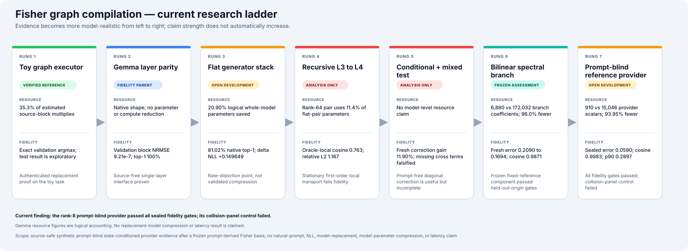
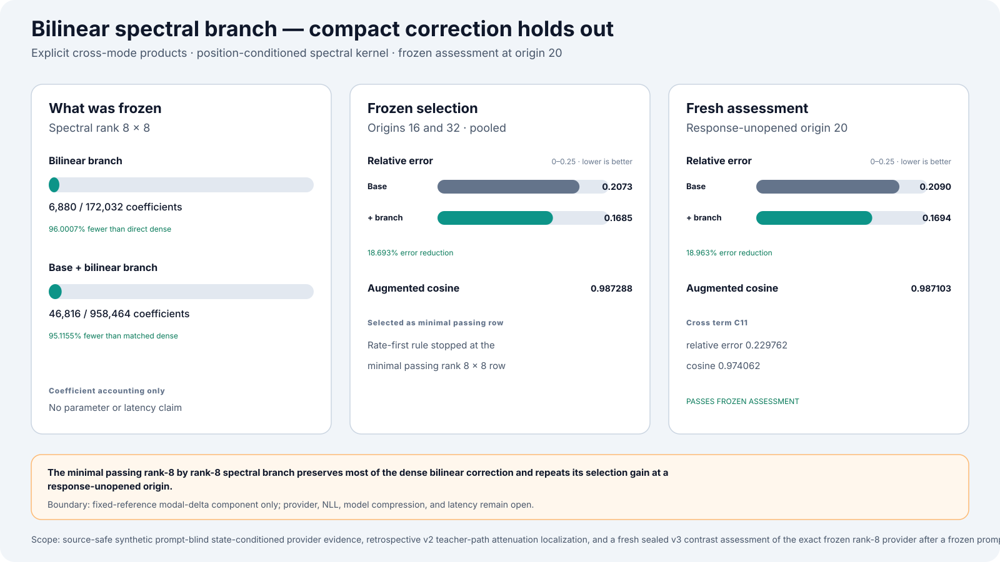
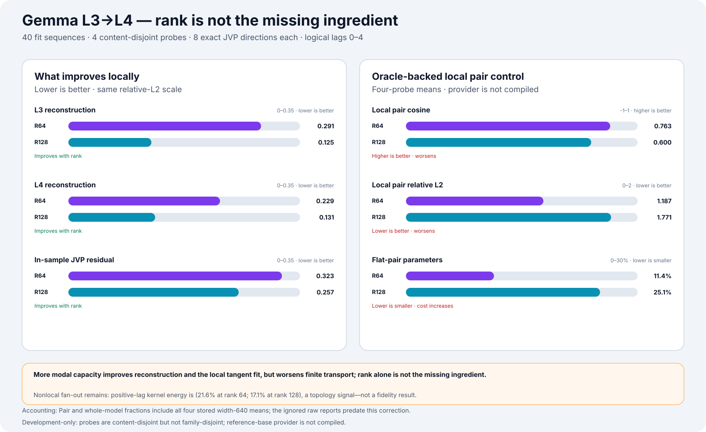
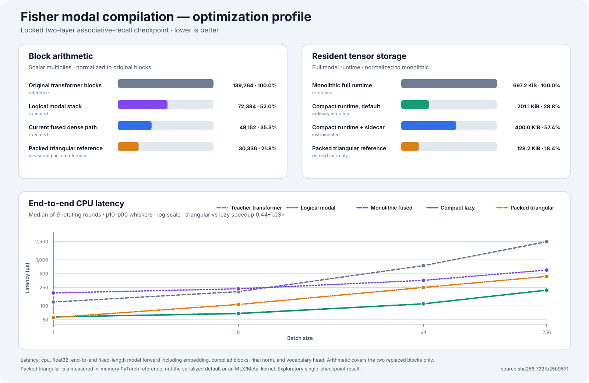

# Fisher Graph Compilation

An instrumentable transformer compiler research project.

The central question is whether frozen transformer computation can be
re-expressed as a smaller causal graph:

```text
weights
  ↓
Fisher coupling
  ↓
parameter clusters
  ↓
computational modes
  ↓
modal generators
  ↓
generator interaction graph
  ↓
inference by graph traversal
```

The repository contains a verified end-to-end toy implementation, a
source-free Gemma layer executor, a full Gemma MLP-stack generator baseline,
and a recursive L3→L4 hierarchy with a prompt-blind state-conditioned
reference-provider experiment. It is a research compiler, not a production
compression library.

[](docs/images/research-ladder.svg)

## Current finding

A source-normalized rank-8 reference provider now passes every frozen
candidate-fidelity and structural gate on a sealed, family-disjoint synthetic
Gemma panel—without using prompt text, token IDs, a tokenizer, natural
activation rows, or prompt-local kernels during provider fitting.

The v1 executor mixed every eligible earlier source by summation. Its errors
accumulated after source activity began, and no rank passed the per-probe tail
gate. V2 adds one learned source score to the shared causal pair state and
factorizes each edge as

\[
p(\text{source}\mid\text{query})\,
p(\text{expert}\mid\text{query},\text{source}).
\]

The source probabilities are masked and normalized only over eligible earlier
positions. This adds 16 scalars to each candidate, preserves exact causality
and padding behavior, and leaves the original summed-source executor available
for legacy artifacts.

All 80 fit probes were held fixed. Selection used 32 genuinely fresh probes
with zero shared hashes or direction seeds versus v1. The smallest passing
candidate was `spectral-r08-t08`:

| metric | fresh selection | sealed assessment |
|---|---:|---:|
| Fisher-weighted relative error | `0.08263` | `0.05900` |
| Reference cosine | `0.99659` | `0.99826` |
| Maximum per-probe p90 error | `0.28775` | `0.28970` |
| Worst family relative error | `0.09940` | `0.09502` |
| Error reduction vs constant | `58.11%` | `47.80%` |
| Error reduction vs position-only | `58.12%` | `47.92%` |

The provider stores 910 scalars versus 15,046 for the dense-64 provider
(`93.95%` fewer). Under the declared ideal mathematical accounting, it uses
`87.16%`, `79.54%`, `71.28%`, and `58.65%` fewer provider MACs at sequence
lengths `32`, `72`, `128`, and `256`. Those counts exclude activation,
softmax, masking, additions, memory traffic, and surrounding Gemma work; they
are neither whole-model compression nor latency measurements.

The preregistered composite assessment is still formally **failed**. Its only
false gate was a teacher-panel identifiability control, not a prediction
metric: the minimum true-target difference across collision groups was
`9.24e-6` against a required `0.01`. All four radial-scale groups cleared the
threshold, while all eight axis-sign and all four gain-null groups did not.
The clean conclusion is therefore:

- sealed prompt-blind provider fidelity is positive across sparse, chirp,
  axis, radial-collision, and null-collision families;
- the current collision panel cannot establish a 1% downstream effect for
  every tagged variable; and
- prompt-independent basis discovery, natural-prompt transfer, NLL,
  whole-model replacement, compression, and speed remain unproven.

The upstream Fisher basis is itself prompt-derived. “Prompt-blind” here means
provider relation mapping after that basis was frozen, not prompt-independent
basis discovery.

### What this builds on

The compact bilinear modal-generator branch passed its earlier frozen,
no-refit Gemma assessment.

The preceding mixed-mode rung had falsified a cross-free linear-plus-diagonal
executor: at a fresh origin, measured mode interaction accounted for `11.27%`
of response norm and a truth-leaking interaction oracle reduced error by
`23.10%`. Crucially, `80.74%` of that interaction energy lived in the
quadratically scaling odd-odd component \(C_{11}\). That made an explicit
off-diagonal product branch a testable repair rather than an unconstrained
nonlinear fit.

The compiler now maps the eight nominated sensitive modes to all 28 canonical
products

\[
\phi_{ij}=2(\Delta m_i/\sigma_i)(\Delta m_j/\sigma_j),\qquad i<j,
\]

then transports those features through a position-conditioned causal spectral
generator. It measured fit origins `8/24/40`, selected rank only at origins
`16/32`, sealed the resulting candidate, and opened origin `20` only in the
separate assessment command. Origin `28`, used to nominate the architecture,
was never reused for fitting.

The smallest passing plan was rank `8×8`:

- `6,880` stored coefficients versus `172,032` for the matched dense bilinear
  family—`96.00%` fewer;
- selection error `0.20726 → 0.16852`, an `18.69%` reduction, at cosine
  `0.98729`;
- fresh origin-20 error `0.20901 → 0.16937`, an `18.96%` reduction, at cosine
  `0.98710`;
- fresh \(C_{11}\) relative error `0.22976` and cosine `0.97406`; and
- `94.10%` recovery of the measured \(C_{11}\) oracle headroom on the sealed
  assessment.

The rank curve is strongly compressible: the direct dense branch reaches
selection error `0.16625`, only `0.00227` below the selected rank-`8×8`
branch. Six fresh control pairs passed the frozen structural-control gates
(pooled leakage `0.0562`; worst reliable pair `0.0822`), the branch is exactly
zero on singleton axes, and the prepared float32 graph matched the analytic
implementation to `1.47e-7` relative error on assessment.

Combined with the existing linear and diagonal branches, the compiled edge
stores `46,816` coefficients versus `958,464` for the matched dense
three-branch family (`95.12%` fewer). This is the first positive no-refit
evidence that a compact generator can transport known mixed-mode edges across
positions. It is not yet whole-model compression: the prompt-conditioned
reference provider and surrounding Gemma weights are excluded, only known
pair identities were tested, and no NLL, task-accuracy, or latency claim has
been made.

[](docs/images/bilinear-spectral-assessment.svg)

The earlier rank-only failure that led to the conditional and bilinear
branches remains useful context:

[](docs/images/l3-l4-rank-diagnostic.svg)

The figures are generated from the committed
[`source-safe research summary`](artifacts/research/current_research_summary_v1.json),
which binds the underlying report digests without committing prompts, token
IDs, model weights, or tensor artifacts. Tests reject stale SVGs.

The next experiment is therefore:

1. preserve v2 permanently as a composite-control failure—do not rerun its
   consumed panel or lower its threshold;
2. preregister a fresh v3 panel with new modes, positions, sequence lengths,
   seeds, hashes, and a new one-shot ledger identity;
3. split the overloaded collision gate into teacher-construct checks:
   sensitivity controls such as radial scale require a minimum contrast,
   expected-null controls require a maximum contrast, and underpowered groups
   are marked panel-inconclusive rather than candidate-wrong;
4. add a candidate contrast-recovery metric that directly compares predicted
   and measured target differences within sufficiently identified groups;
5. if that fresh gate passes, freeze the provider with the linear, diagonal,
   and bilinear branches in one L3→L4 graph and run source-authoritative shadow
   execution on a family-disjoint natural-prompt split, scoring NLL,
   full-vocabulary KL, and top-1 agreement; and
6. only after downstream fidelity passes, measure resident storage, active
   compute, and end-to-end latency.

This work is described in
[`docs/recursive-modal-hierarchy.md`](docs/recursive-modal-hierarchy.md).

## What has actually worked

| Rung | Resource result | Fidelity result | Claim |
|---|---|---|---|
| Toy V2 whole-span executor | `31.60%` fewer deployment parameters; ideal matrix work is `60.70%` of native | Exact fresh-validation task behavior; reserved executor test remains sealed | Validation-backed structural compression on the toy task |
| Toy fused executor | Dense fused path executes `35.3%` of the replaced blocks' reference multiplies | Exact validation argmax; NLL delta `1.86e-7` | Verified runtime reference |
| Gemma structured layer | No compression; native-shaped layer is retained | Validation block NRMSE `9.21e-7`, top-1 `1.0`, zero source-layer calls | Replacement interface and activation-only fitting proven |
| Gemma 18-generator MLP stack | `20.90%` logical whole-model parameters saved; `79.17%` native MLP matrix MACs removed | After trajectory refit: delta NLL `+0.149649`, native top-1 `81.02%` | Open-development rate/distortion point, not accepted compression |
| Gemma L3→L4 hierarchy, rank 64 | Pair state is `11.4%` of the flat pair; nominal saving is only `0.685%` of the flat-generator whole model and excludes the reference provider | Local-control cosine `0.763`, relative error `1.187` | Analysis only; finite transport fails |
| Gemma L3→L4 spectral map, rank 64 | Source-σ-weighted ranks are `11 / 18 / 34` at `90% / 95% / 99%` energy; no deployed reduction | Local-to-`1σ` mean cosine `0.9996`; two-origin mean similarity `0.672` | Prompt-free fixed-reference analysis only; position-conditioned |
| Gemma conditional spectral modal-delta executor | `39,936` edge coefficients versus `786,432` for a matched dense two-branch family (`94.92%` fewer); provider and model excluded | Fresh origin-20 local cosine `0.9819`; diagonal correction reduces finite error `0.2278 → 0.2006` | Prompt-free fixed-reference interior interpolation only; no-refit assessment |
| Gemma mixed-mode chord assessment | No deployed reduction; frozen candidate unchanged | Fresh origin-28 error `0.1863`, cosine `0.9834`; cross nonadditivity `11.27%`; interaction-oracle gain `23.10%` | Diagonal-only correction materially falsified; compact bilinear branch nominated |
| Gemma bilinear modal-generator executor | Bilinear branch stores `6,880` coefficients versus `172,032` dense (`96.00%` fewer); all three edge branches store `46,816` versus `958,464` matched dense (`95.12%` fewer) | Fresh origin-20 error `0.2090 → 0.1694` (`18.96%` reduction), cosine `0.9871`; recovers `94.10%` of \(C_{11}\) oracle headroom | Positive no-refit mixed-mode edge transport; fixed-reference and known-pair scope only |
| Gemma prompt-blind reference provider v2 | Rank 8 stores `910` scalars versus `15,046` for the full-width provider (`93.95%` fewer); provider-only ideal MAC savings are sequence-dependent | Sealed error `0.0590`, cosine `0.9983`, p90 `0.2897`; every fidelity/structure gate passed | Strong synthetic family transfer after a frozen prompt-derived basis; formal composite assessment failed its teacher collision-panel gate |

There are three important distinctions:

- The toy system proves that Fisher modes can become a real graph executor.
- The exact Gemma layer proves that the model adapter and replacement boundary
  can reproduce a native layer without calling it.
- The Gemma compression and hierarchy rungs have not yet met a
  source-authoritative downstream-fidelity gate.

## Current Gemma baseline

The flat full-stack compiler replaces all 18 Gemma MLPs with rank-640 affine
generators while leaving attention, normalization, embeddings, and the
language-model head native.

The sequential compiled-trajectory refit reduced the original generated
stack's excess NLL by `57.1%`, from `+0.348476` to `+0.149649`, at the same
logical resource budget. A prepared CPU runtime then measured:

| Path | Factorized speedup | Fused speedup |
|---|---:|---:|
| Prefill, context 32–256 | `1.42–1.62x` | `1.50–1.73x` |
| Cached decode, context 32–256 | `1.21–1.24x` | `1.26–1.28x` |

Those are real batch-one PyTorch/CPU timings on an open-development prompt,
not a GPU result, confidence interval, or downstream-quality-qualified
deployment. The fused path is also a distinct float32 rate/distortion point:
precomposing its factors changes operation order and worsens end-to-end
fidelity.

See
[`docs/modal-generator-compiler.md`](docs/modal-generator-compiler.md) and the
committed
[`source-safe runtime report`](artifacts/gemma3_runtime/full_model_runtime_analysis_dev_v1.json).

## L3→L4 evidence, interpreted narrowly

The live hierarchy rung measures:

- joint activation covariance across the L3 output and L4 input;
- valid-position score-gradient Fisher induced by summed prompt NLL;
- Fisher-balanced restriction and prolongation factors;
- a literal-zero topology tear and a mean-source execution reference;
- signed causal JVP kernels for logical lags 0 through 4; and
- dense, factorized, and staged execution of the bound prompt-local pair plan.

The observed activation cross-coupling is strong, and about `21.6%` of the
rank-64 kernel energy lies at positive logical lags. That supports real
fan-out beyond a same-token map. The near-one cross-Fisher value is
chain-related because both sites derive from the same sequence NLL; it is not
semantic equivalence or replacement fidelity.

The reference-base tensor is still produced by the frozen transformer
boundary. The runtime authenticates the factors, mean, positions, mask, and
JVP artifact, but it cannot yet authenticate that external provider. Pair
parameter and MAC reductions are therefore shape-only opportunities, not
achieved model compression or speedups.

## Verified toy reference

The toy transformer is intentionally small enough to inspect completely. It
includes activation capture, empirical activation-space Fisher matrices,
compute modes, interventions, position-conditioned execution, conditional
completion, independently compiled layers, algebraic fusion, lazy
instrumentation, a packed triangular reference, and an optional MLX/Metal
lowering.

The clean V2 whole-span executor replaces all three source blocks, makes zero
native-block calls, and preserves exact behavior on 246 fresh validation
contexts. Its compiled deployment contains 19,064 parameters versus 27,872
native (`31.60%` fewer), and its ideal complete matrix work is `60.70%` of
native. The reserved 250-context executor test remains hash-only, and the task
is narrow query-sparse associative recall—not language modeling. See the
[clean V2 protocol](docs/conditional-computation.md#v2-clean-expanded-task-replication).

[](docs/images/fused-executor-optimization.svg)

The figure is regenerated from
[`artifacts/associative_recall/fused_executor_report.json`](artifacts/associative_recall/fused_executor_report.json);
the test suite rejects it if the committed SVG becomes stale. The packed
triangular implementation is a measured PyTorch reference, not the default
backend or a generally faster GPU kernel.

Detailed toy reports and replayable tensors live under
[`artifacts/associative_recall/`](artifacts/associative_recall/). The previous
full README, including the complete experiment chronology and command
catalog, is preserved as [`RESEARCH_LOG.md`](RESEARCH_LOG.md).

## Architecture

The code is organized around explicit compiler boundaries:

1. **Model adapters** describe layers, activation sites, parameters, masks,
   logical positions, cache semantics, dtype, and device policy.
2. **Instrumentation** captures selected activations and score gradients
   without changing source weights.
3. **Analysis** builds Fisher/covariance moments, modes, causal JVP edges, and
   guarded rate/distortion measurements.
4. **Compilation** lowers authenticated modes and edges into graph plans with
   explicit means, restrictions, prolongations, causal schedules, and
   provenance.
5. **Execution** runs dense controls, factorized graphs, staged sessions, or
   source fallbacks through a common replacement boundary.
6. **Validation** separates fit, selection, assessment, and reserved roles and
   fails closed before stronger claims.

The complete interface and scaling design is in
[`docs/compiler-architecture.md`](docs/compiler-architecture.md).

## Quick start

The core repository requires Python 3.10 or newer:

```bash
python -m venv .venv
source .venv/bin/activate
pip install -e ".[dev]"

python -m pytest
fisher-graph-experiment
fisher-graph-verify
```

Regenerate the committed research figures:

```bash
fisher-graph-plot-research
fisher-graph-plot-optimizations
```

Gemma experiments are opt-in. Accept the model license on
[Hugging Face](https://huggingface.co/google/gemma-3-270m), keep the model in
an external cache, and install the adapter dependencies:

```bash
pip install -e ".[dev,gemma]"
hf auth login
```

The current hierarchy command requires the frozen full-stack base/refit
artifacts described in the recursive-hierarchy documentation:

```bash
fisher-graph-gemma-l3-l4-hierarchy-dev \
  --revision 9b0cfec892e2bc2afd938c98eabe4e4a7b1e0ca1

fisher-graph-gemma-l3-l4-spectral-dev \
  --sequence-length 72 \
  --all-source-modes \
  --impulse-positions 8,16,24,32,40 \
  --max-lag 31 \
  --fft-length 64

fisher-graph-gemma-l3-l4-conditional-spectral-dev compile

fisher-graph-gemma-l3-l4-mixed-mode-dev

fisher-graph-gemma-l3-l4-bilinear-spectral-dev compile \
  --device cpu \
  --dtype float32

fisher-graph-gemma-l3-l4-bilinear-spectral-dev assess \
  --candidate \
    .local-runs/google--gemma-3-270m/modal-generator-l3-l4-bilinear-spectral-executor-dev-v1.pt \
  --candidate-file-sha256 \
    631006014eaf092a27a72d2918ab61d144fe925896a4ccb812094e10d1200cf7 \
  --candidate-report-sha256 \
    856d116f687fcde936e447d8f14053e74fa9ebf3a6996a60c527cec2e541a37a \
  --device cpu \
  --dtype float32
```

No Gemma weights or local tensor artifacts are committed. Development runs
default to the ignored `.local-runs/` tree.

## Documentation

### Start here

- [Compiler architecture](docs/compiler-architecture.md)
- [Recursive modal hierarchy](docs/recursive-modal-hierarchy.md)
- [Full research log and command archive](RESEARCH_LOG.md)

### Current generator research

- [Modal-generator compiler](docs/modal-generator-compiler.md)
- [Generator causal fingerprints](docs/generator-causal-fingerprints.md)
- [Generator causal map](docs/generator-causal-map.md)

### Compression and conditional-compute experiments

- [Structured Gemma layer executor](docs/structured-layer-executor.md)
- [Dense supermode compaction](docs/dense-supermode-compaction.md)
- [Cross-block selective bundling](docs/cross-block-selective-bundling.md)
- [Fisher-need conditional computation](docs/conditional-computation.md)

### Earlier Gemma foundations

- [Gemma 3 270M experiment archive](docs/gemma3-270m.md)
- [Weighted-Jacobian compilation](docs/weighted-jacobian-compilation.md)
- [Residual-separated gated executor](docs/gated-executor.md)

## Scientific claim boundaries

The repository uses deliberately narrow status language:

- **Verified reference** means the committed toy artifact passed its declared
  equivalence and replay controls.
- **Parity** means a candidate reproduces a source boundary but may save
  nothing.
- **Open development** means the data helped choose the next experiment and
  cannot serve as fresh confirmation.
- **Shape-only** means parameter or MAC counts omit an uncompiled provider,
  router, kernel, or other required runtime work.
- **Rejected** means the tested candidate failed its declared gate; it does not
  prove the entire method impossible.
- **Measured latency** is always scoped to the reported device, backend, shape,
  batch, and timing protocol.

Validation, reserved test data, model weights, prompt text, token IDs, and
large tensor artifacts are not silently promoted into committed evidence.
Source-safe reports retain aggregates, hashes, provenance, and claim
boundaries.

## Repository layout

```text
src/fisher_graph/        compiler, analysis, runtimes, and experiment CLIs
tests/                   unit, artifact, replay, and stale-figure checks
docs/                    architecture and experiment-specific protocols
docs/images/             deterministic source-backed SVG summaries
artifacts/               committed toy artifacts and source-safe reports
examples/                prompt/split scaffolding and toy examples
.local-runs/             ignored local Gemma tensors and reports
```

The project is currently testing whether nonlinear conditional transport can
turn measured cross-layer modal structure into a self-contained, faithful
Gemma graph. That is the gate before another rank ladder or compression claim.
