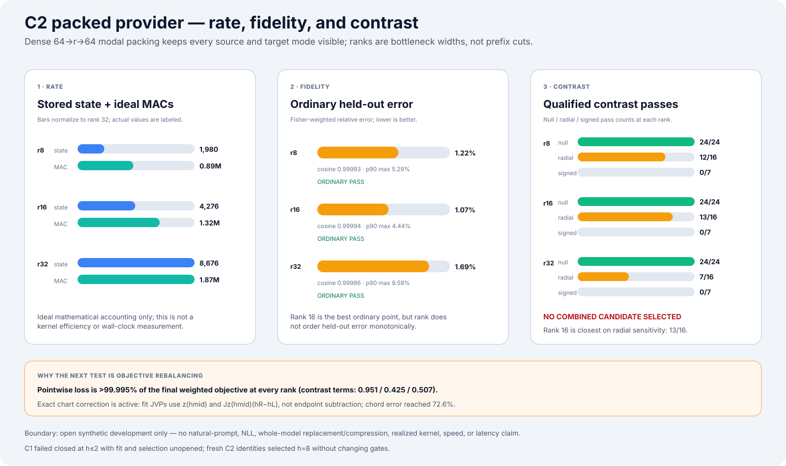
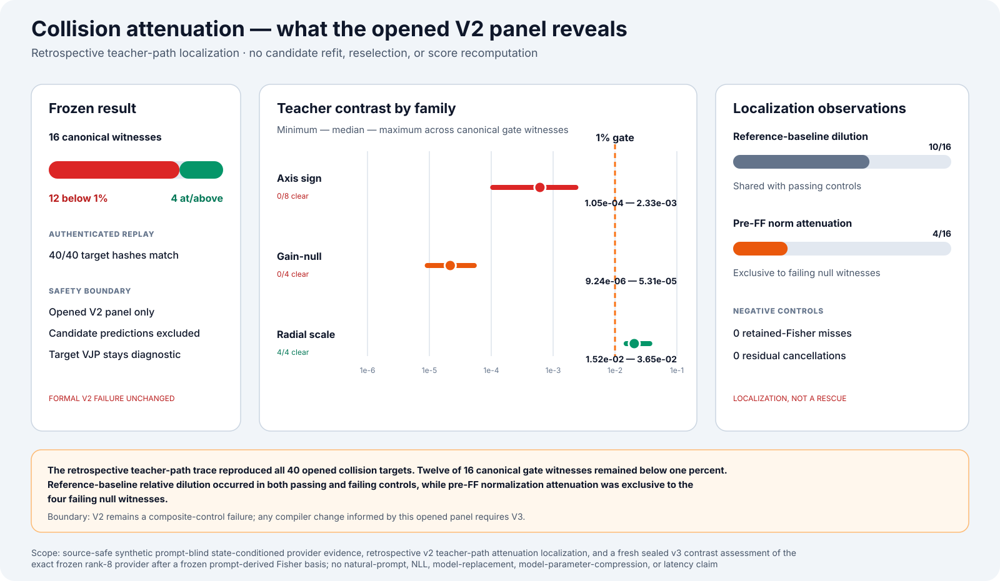
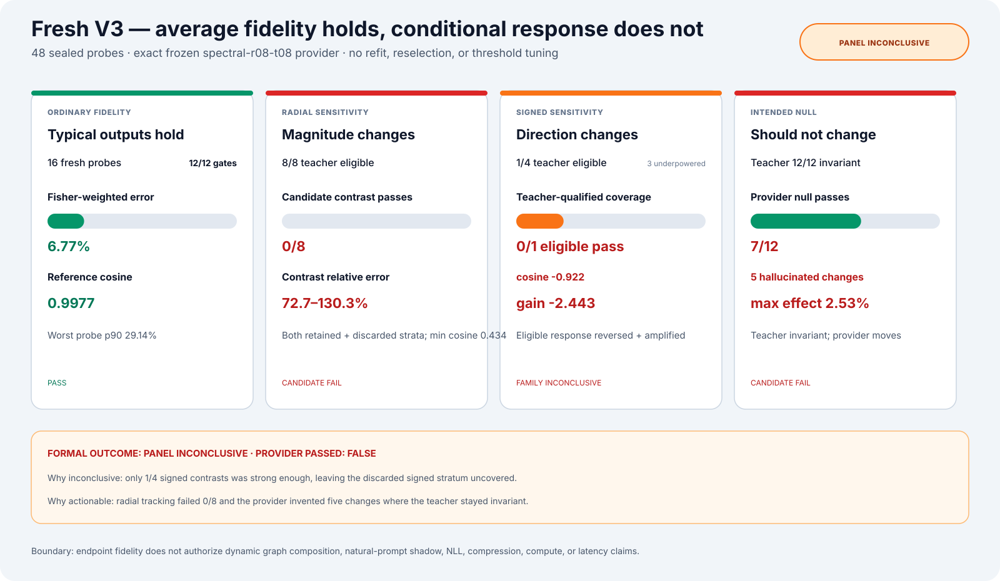

# Fisher Graph Compilation

An instrumentable transformer compiler research project.

The central question is whether frozen transformer computation can be
re-expressed as a smaller causal graph:

```text
weights
  ↓
Fisher coupling
  ↓
parameter clusters
  ↓
computational modes
  ↓
modal generators
  ↓
generator interaction graph
  ↓
inference by graph traversal
```

The repository contains a verified end-to-end toy implementation, a
source-free Gemma layer executor, a full Gemma MLP-stack generator baseline,
and a recursive L3→L4 hierarchy with a prompt-blind state-conditioned
reference-provider experiment and fresh sealed contrast assessment. It is a
research compiler, not a production compression library.

[](docs/images/research-ladder.svg)

## Current finding

The fixed alpha-0.5 H4 generator has now been rejected by its fresh
family-disjoint finite-NLL selection gate. The one-shot panel contained 16
new prompts across eight new families. It compared the accepted X4 parent,
the matched lag-only alpha-0 baseline, and the frozen alpha-0.5 challenger
against the same direct factorized-model source outputs.

| arm | H4 params / MACs per token | absolute aggregate ΔNLL/token | source→candidate KL/token | top-1 agreement | prompt p90 absolute ΔNLL | absolute gate |
|---|---:|---:|---:|---:|---:|:---:|
| accepted X4 only | `0 / 0` | `0.222797` | `1.286448` | `45.85%` | `1.030822` | fail |
| matched alpha 0 + B | `13,312 / 13,312` | `0.532629` | `1.396646` | `41.29%` | `1.388934` | fail |
| alpha 0.5 challenger | `34,048 / 34,048` | `0.408207` | `1.276282` | `43.05%` | `0.968875` | fail |

Relative to the matched alpha-0 control, alpha 0.5 reduced the family-macro
mean prompt error by `13.30%` and won exactly `6/8` families. That confirms
that realized H4 state contains useful incremental signal. It did not
generalize uniformly: symbolic equivalence regressed `14.91%` and unit
consistency regressed `29.62%`, far outside the preregistered `2%`
worst-family limit. The challenger also failed all five absolute source
fidelity gates. The accepted X4-only context remained better on aggregate
ΔNLL and top-1 agreement while requiring no H4 head.

The formal result is therefore `qualified: false`. Guard evaluation stays
closed, and there is no model-level compression, deployment, or latency
claim. The durable report is bound by logical hash
`63bcc5f6b03cee408164583a01109023aeb2352e3a4fa15e23ddbc2d7b842f35`,
finite-NLL hash
`3d842a558d5fb31b5ed99623c2527867a3b6936dd55e427c88c5da4939fbb044`,
and file hash
`43accd933ea8fce333d056abe7d197a8dd7178049a4c8c9d2a8c9ff2a539ad14`.

The follow-up reusable-fit attribution now separates the two compiled
boundaries instead of treating the rejected stack as one unit. It crosses
the base bridge versus the accepted X4 repair with no H4 head, the lag-only
`B` head, and the independent-state H4 head. One direct factorized-model
source plus six factorial cells over 16 examples produced exactly 112
forwards and 96 scalar/hash-only comparisons:

| X4 / H4 arm | compiled auxiliary params | logical MACs/token | prompt-absolute ΔNLL/token | KL/token | top-1 | X4 RMSE | H4 RMSE |
|---|---:|---:|---:|---:|---:|---:|---:|
| base / none | 403,328 | 217,920 | 0.395952 | 1.304834 | 41.14% | 0.562206 | 32.0043 |
| base / lag `B` | 416,640 | 231,232 | 0.300136 | 1.002118 | 45.03% | 0.562206 | 25.4643 |
| base / independent state | 437,376 | 251,968 | 0.302431 | 1.001871 | 44.94% | 0.562206 | 24.1366 |
| accepted X4 / none | 424,832 | 239,424 | 0.288211 | 1.275279 | 40.88% | 0.457586 | 34.9819 |
| accepted X4 / lag `B` | 438,144 | 252,736 | 0.265847 | 0.891692 | 45.72% | 0.457586 | 14.5398 |
| accepted X4 / independent state | 458,880 | 273,472 | 0.265434 | 0.892949 | 45.38% | 0.457586 | 14.4005 |

This identifies two real but overlapping repairs. The accepted X4 head
reduced prompt-absolute NLL error by `27.21%` and X4 RMSE by `18.61%`
relative to the base bridge. Adding lag `B` to that accepted parent reduced
prompt error another `7.76%` and H4 RMSE by `58.44%`. The independent-state
path then reduced H4 RMSE only another `0.96%` and prompt error only `0.16%`,
while adding 20,736 parameters and MACs over `B`; it also slightly worsened
KL and top-1 agreement and won only four of eight fit families.

The important diagnosis is objective mismatch, not absence of signal.
Accepted X4 plus either H4 head brings signed aggregate ΔNLL close to zero,
but prompt-absolute error stays near `0.266`: positive and negative prompt
errors are canceling. Euclidean H4 alignment can improve dramatically
without comparable finite-NLL fidelity. The next iterative compiler rung
should therefore retain accepted X4, use lag `B` as the cost-aware H4
baseline, and fit the next residual directly against per-prompt
source-authoritative behavior rather than adding more independent H4
capacity. This factorial is reusable-fit diagnosis only—not held-out
generalization, qualification, compression, or speed evidence. Its report
is bound by logical hash
`9fde13193b3ee915845247de3821e84ec84dbae368a2e3554e4c9423927878ed`
and file hash
`2e9fc09804af10199739ad6c14df658a6a81550e4e14b5eeb9170c52d5a809ab`.

The first explicit residual-boost iteration is also complete. It froze the
accepted-X4 plus lag-`B` parent, fit four causal logical-position scales with
eight leave-one-family-out folds, and evaluated each prompt with the provider
that never saw its family. The live campaign made exactly 64 model forwards
and added only four scalar slots plus at most 640 logical MACs/token. The
candidate was **not retained**: family-macro mean prompt-absolute NLL error
rose from `0.268343` to `0.299215` (`-11.50%` relative improvement), only
`2/8` families won, and the worst family regressed `70.64%`. KL worsened
`2.21%`, top-1 agreement fell from `45.72%` to `44.90%`, prompt p90 error
rose `4.30%`, and prompt p10 top-1 agreement fell from `40.00%` to `37.68%`.

This failure is unusually informative. The parent-point Jacobian predicted
the exact candidate with correlation `0.998966`, RMSE `0.021381`, and
`100%` sign agreement; its predicted prompt error was already `11.10%`
worse. The finite displacement did not invalidate the linear model. Instead,
position-only lag-`B` amplitudes failed to generalize across families. The
first two buckets were outside target support in every fold, while the two
supported scales changed sign or magnitude by held family. The frozen parent
therefore remains iteration zero. The next candidate should introduce a
small causal prompt/state-conditioned **direction**, not more global
position damping or a path-integrated Jacobian. The development report is
replay-bound to every fold fit, OOF provider/execution/observation, and
resource receipt. Its collection hash is
`dee8864210f6047e3f05b67515a5f77b54a1ccbe332de5b9eb96519eca33714c`,
logical report hash is
`1e1e284d354dd6048406b99a335bc2065e6767e706b8e781791bb1fd365c49ca`,
and file hash is
`4ace545b0dea88aeebbbe7e8ddd57a89ff986e56a1817ab4500ad44fa056afb3`.

### Parallel capacity-control rung

The authenticated function-preserving expert-count control held outer rank
64, expert rank 64, router width 16, and the complete D3 fit contract fixed
while raising the routed expert count from two to four. Every parent expert
was split into an active child and a dormant child. Duplicating its router
logit halves each child's probability; doubling the active child's output and
zeroing the dormant child's output preserves the parent contribution. The
primary observable and provider-chart JVP therefore matched at initialization
to maximum absolute errors of `1.78e-15`, with exactly zero weighted-objective
difference. The dormant paths also passed the preregistered two-step
gradient-openness checks.

| arm | stored scalars / canonical MACs | ordinary error / cosine | null | radial pass / macro error | signed pass / macro / worst error | weighted training objective |
|---|---:|---:|---:|---:|---:|---:|
| 2-expert exact source replay | `31,492 / 5,555,776` | `0.00621631 / 0.99998116` | `24/24` | `16/16 / 0.063077` | `3/8 / 0.383903 / 0.752043` | `0.164106` |
| 4-expert matched lift | `48,166 / 8,985,792` | `0.00555688 / 0.99998460` | `24/24` | `16/16 / 0.054820` | `3/8 / 0.362307 / 0.668409` | `0.144633` |

Both arms passed all `12/12` ordinary, `24/24` exact-null, and `16/16`
radial checks. Four experts improved ordinary error by `10.61%`, radial macro
error by `13.09%`, signed macro error by `5.63%`, signed worst error by
`11.12%`, and the weighted training objective by `11.87%`. Those are real
continuous improvements, but they did not recover another categorical
identity: both arms passed only `base_01`, `base_04`, and `base_06` of the
eight signed checks. The maximum ordinary per-probe p90 error also worsened by
`4.53%`.

The valid formal outcome is `primary_both_fail`. The conditional replication
did not run because only a valid 2-expert-fail / 4-expert-pass primary result
could open it. Four experts cost `52.95%` more stored scalars and `61.74%`
more declared canonical MACs than two. This is therefore a causal negative
result for four routed experts under the matched 600-step budget, not
compression or speed evidence. It authorizes only a separately preregistered
eight-expert full-count oracle. It authorizes no descending expert-count
ladder, C3, held-out generalization, full-model replacement, compression,
rank reduction, or wall-clock speed claim.

The durable external result receipt is logical artifact
`8c07a30129f2bb7c5e704e54ffc7e23fc947a27367d164490002e26aa699a015`,
tensor file
`1dda9cdae257a18155c49a8daac90ef13401d7928a1a506a5d3027e2b35ebf4f`,
and report
`cef24e40718ef2c6983d3fd08f45a1e5b5f87e2a2b07f710bc297570726d0723`.
The protocol binding is
`84c423f4f4b3020ff07d2340379707586c51f706b046edf96e4a0a95adf8c6bc`
and the code bundle is
`e6a22bb29f468c9f8ab02fd308e6eb648cd9da09f95b3ed041a7aa364b62b127`;
the executable protocol was preregistered in commit `0f3166d` and its exact
source-replay finalization was corrected and refrozen in commit `d69024c`
before the accepted run. The tensor artifact and tensor-free JSON report
remain ignored under `.local-runs/`; the receipt recorded here is the durable
trust root.

```bash
fisher-graph-gemma-l3-l4-function-preserving-expert-count-dev describe

fisher-graph-gemma-l3-l4-function-preserving-expert-count-dev run \
  --device cpu \
  --dtype float32
```

### Parallel compiler rung: graph-organized global SVD

The graph-Fourier result is now separated into the jobs it actually performs
well. A rank-45 global SVD supplies the numerical compression basis, while the
fit-only signed Fisher/GFA graph organizes those retained generators into
four routable packs. Turning on all packs reproduces the same SVD operator;
the graph changes only generator layout and conditional execution.

The frozen Gemma plan uses packs `8 / 8 / 8 / 21`. Its deployment-form edge
state contains `279,744` float coefficients versus `393,216` dense fit-knot
coefficients (`28.86%` fewer). For a complete 32-lag response with
interpolated cores cached, all-on rank-45 execution uses `72.51%` of the dense
linear MACs.

The routing curve was corrected for an important C2 data confound: exact-zero
padding is about 91% of the raw rows and is excluded before rate scoring. On
the 1,132 nonzero development-selection directions at held-out response
origin 32:

| organization / retained bound mass | mean active rank | cached-core MAC fraction | error vs dense measured response |
|---|---:|---:|---:|
| all-on global SVD | `45.00` | `72.51%` | `3.179%` |
| signed-GFA packs, `95%` | `43.78` | `70.61%` | `3.206%` |
| contiguous SVD packs, `95%` | `43.14` | `69.60%` | `4.148%` |
| signed-GFA packs, `90%` | `30.33` | `49.58%` | `12.936%` |
| contiguous SVD packs, `90%` | `30.61` | `50.02%` | `10.724%` |

This is a useful but mixed result. The graph organization gives the better
high-fidelity point against the contiguous control, but the contiguous
control wins at the more aggressive threshold. Eight size-matched random
controls also remain in the artifact. The router uses conservative
operator-norm certificates and reuses the source projection, but its cost is
excluded from the displayed cached-core MAC ratios. A later float-execution
audit found that the exact-arithmetic certificate does not yet bound the
implemented accumulation tightly enough, so routing is disabled in the
locked one-shot rung.

The opened C2 split makes this development evidence, not fresh confirmation.
A subsequent source-authoritative shadow did measure one Calibration-A
natural prompt. It rejected the current edge: the all-on modal error was
`4.8208`, a true 64-mode projection oracle still had `0.9741` full-width
error, and exact X4 injection still changed NLL by `+2.0121` per token because
the residual carrier was incomplete. This is development diagnosis, not
held-out confirmation, whole-block replacement, whole-model compression,
wall-clock latency, or GPU speed. The ignored graph artifact is bound by
logical hash
`b3e011d8067ff3538888851c476fba03c57f4e9f172f923c20fdd90ac0799f84`,
tensor file
`d77a60532b660160413331ceddbe8d970c2828d53ff5788642250ff3c5d49fa1`,
and report
`5c958c54fbcd55239cc1f5943dcb1bf138bbd4116233783bf7020e1023f4998a`.

The one-shot path is now fail-closed around that diagnosis. Its only supported
Calibration-B entry point preflights the exact runtime, live adapter, and
locally loaded Gemma tokenizer; atomically claims the manifest in one fixed
per-user host ledger; and only then loads each of the 96 prompts by identity.
It owns tokenization, the required `3 + 1 + 1` source/oracle forwards per
prompt, streaming evaluation, and terminal receipt creation. No independent
held-out issuer, evaluator, report callback, or caller-supplied observation
can produce a supported success receipt. The tokenizer check binds its backend
program, full token-to-ID vocabulary, added/special tokens, and library
versions—not only its name and configuration.

Per-example receipts bind the prompt identity, exact token tensors,
model/executor fingerprints, causal grid, both oracle interventions, and every
tensor being scored. The internal evaluator requires the complete frozen
96-example panel, all valid next-token boundaries, the real `262,144`-token
Gemma output vocabulary, and unique receipts while streaming scalar
statistics. Only the scalar report and immutable terminal receipt escape.
Hashes are reproducible integrity/audit receipts, not hostile in-process
attestation, and the host ledger is not a cross-machine authority. The
transaction has not been invoked here, so Calibration B remains unopened.

That failed rank-64 candidate can now be used as iteration zero of a
residual-guided progressive compiler rather than treated as an all-or-nothing
answer. The model-independent controller repeats fit-only residual mapping,
typed graph mutations, and family-disjoint A-selection measurements. Failing
candidates enter a repair phase; candidates inside the fidelity envelope
enter a Pareto compaction phase. Every accepted transition is parent-bound and
charges compiled, support, and retained-source parameters, bytes, and logical
MACs. Declared-incomplete or scope-incomparable accounting cannot authorize a
candidate.

The Gemma-specific worker and first candidate-bound lowerer are now present.
The worker materializes three
strict A-only panels, streams source-authoritative seed/projection/carrier
metrics, and maps distinct residuals at `layer.4.mlp.normalized_input` and the
complete `layer.4.output` boundary. A single native autograd pass differentiates
next-token NLL with respect to both X4 and H4; the private A-fit archive keeps
full L3 source modes, logical positions, masks, native/candidate boundaries,
and gradients while scalar receipts retain only hashes and ranked geometry.
After X4 is accepted, a separate fit-only pass can replay that exact
candidate, detach its realized H4 as the autograd leaf, and measure the
candidate-conditioned H4 NLL VJP. The bridge requires this gradient pass to
produce a bitwise-identical execution artifact to the ordinary candidate
pass, and it never retains model-parameter gradients.

The mapper uses family/example-balanced residual PCA with a bounded NLL-VJP
alignment tilt and post-hoc activation-gradient-Gram scores. It uses the
native tangent at the seed and the candidate-conditioned tangent after X4;
this is not a Fisher eigendecomposition or held-out JVP validation. The lowerer fits
homogeneous causal finite-displacement ridge kernels and builds immutable X4
or H4 repair heads. Its executable bridge owns one Gemma prefill forward: Y3
is clamped, the rank-64 base graph and X4 head run at X4, the H4 head runs
later in the same nonlinear carrier, and unsupported rows preserve the
same-pass reference rather than a hidden native-X4 fallback. Joint X4+H4
candidates are constructed sequentially—remeasure after X4, then fit H4—so
the H4 target reflects the first head. The baseline H4 repair reads only L3
source modes. The optional realized-state arm also reads the immutable
post-X4, pre-H4-correction activation in the same forward, projects it through
the existing H4 decoder, and mixes those coordinates through an authenticated
`rank × rank` state kernel. Exact scoped parameters, bytes, and linear/modal
MAC upper bounds include the retained Gemma carrier.

This is a tested executable overlay, not a qualified compression result: it retains
the factorized Gemma model and adds bridge/head state. It is also an
integrity-heavy research prefill path, not a latency result: full-model and
tensor hashing, Python dispatch, transfers, temporary memory, cached
autoregressive decode, and wall-clock speed are outside the declared
linear/modal MAC scope. The legacy multi-pass shadow remains the
source-authoritative evaluator.

Repeated selection does not spend the final guard. The implemented campaign
uses separate pairwise family-disjoint `calibration_a_fit`,
`calibration_a_selection`, and `calibration_a_guard` roles. A guard-incapable
development runner can freeze an eligible challenger at
`ready_for_guard_claim`; only a separate finalizer accepts the one-shot guard
callback. In that mode the Gemma worker receives no guard authority, provider,
or materialized guard panel. The claim-gated path still requires an external
durable claim-first authority, and only a guard-passing, budget-compliant
result can emit a candidate-binding handoff. The existing Calibration-B
manifest is registered only as a forbidden identity and remains unopened.
Because the legacy one-shot runtime is bound to the old failed candidate, a
new progressive winner will require a candidate-bound shadow protocol/runtime
before it can consume that final one-shot.

The first real CPU campaign is now recorded as adaptive development. It
preregistered a forced X4 → remeasure → H4 transition, separated actual
candidate-output qualification from ancestor/modal diagnostics, and bound the
earlier pilot transcript as lineage. X4 reduced aggregate and worst-family
boundary relative error by 11.8% and 4.2%, so it was accepted as the staging
step. The original L3-only H4 candidate improved KL and aggregate top-1
agreement but badly regressed absolute and tail NLL, so it was rejected
against the pre-X4 anchor:

| selection candidate | abs. ΔNLL | KL | top-1 agreement | p90 abs. ΔNLL |
|---|---:|---:|---:|---:|
| rank-64 seed | 0.0937 | 1.3092 | 0.4189 | 0.4333 |
| X4 rank-8 | 0.1450 | 1.2833 | 0.3962 | 0.3894 |
| X4 + H4 rank-8 (L3-only input) | 0.3778 | 0.9644 | 0.4792 | 0.7927 |

The result is `stalled_fidelity`: no challenger or handoff was emitted, and
the rotated manifest-global guard remains unopened and unclaimed. The X4
runtime accounts for 212.50M parameters and 212.25M logical MACs/token,
20.74% and 20.82% below raw Gemma respectively, but almost all of that saving
comes from the retained factorized carrier—not from the residual head. The
first loss-aware follow-up has also run. It replaces only the H4 coefficient
fit with the bounded metric `I + u uᵀ`, where `u` is the normalized
source-native NLL gradient; deployed shape and cost remain unchanged.

| H4 fit / input | fit linearized-NLL RMSE | fit normalized-direction RMSE | fit hidden RMSE | selection abs. ΔNLL | selection KL | top-1 | p90 abs. ΔNLL |
|---|---:|---:|---:|---:|---:|---:|---:|
| hidden-residual ridge / L3 | 2.822196 | 2.937411 | 0.000533 | 0.377753 | 0.964429 | 0.479245 | 0.792749 |
| source-NLL-VJP metric / L3 | 2.821386 | 2.936489 | 0.018397 | 0.377860 | 0.964445 | 0.479245 | 0.792909 |
| candidate-H4-VJP remap + metric / L3 | 2.720673 | 3.337574 | 0.021149 | 0.377742 | 0.964426 | 0.479245 | 0.792648 |
| candidate-H4-VJP + realized-H4 decoder modes | 2.720673 | 3.337573 | 0.021148 | 0.389134 | 0.948135 | 0.467925 | 0.799620 |

The candidate-tangent-conditioned arm uses the post-X4 VJP in both residual
direction mapping and the bounded coefficient metric. It reduced fit
linearized-NLL RMSE by `3.60%` versus ridge, but normalized-direction RMSE
worsened `13.62%` and hidden error became `39.69×` ridge. Its held-out
changes were microscopic: absolute ΔNLL improved by `0.0000111`, KL by
`0.0000035`, p90 ΔNLL by `0.0001013`, and top-1 did not change. The H4 child
therefore failed every execution-fidelity axis and was rejected with
`stalled_fidelity`; X4 remains active.

The realized-state arm then held rank, lag count, VJP objective, corpus, and
one-forward execution fixed. For current pre-correction H4 state `h_t`, output
decoder `D`, lagged L3 modes `s`, and state kernel `A`, it executes
`q_t = h_t Dᵀ` and
`Δh_t = [Σ_l s_(t-l) K_l + q_t A] D`. The pointwise term reads no future
position and introduces no feedback loop. At rank 8 it adds exactly 64
parameters, 512 runtime bytes, and 5,184 logical MACs/token.

That feature was active but did not add meaningful fit power: hidden RMSE
improved only `0.00154%`, while the two NLL fit errors changed by less than
`0.000003%`. Held-out KL improved `1.69%`, but absolute ΔNLL worsened `3.02%`,
p90 ΔNLL worsened `0.88%`, and top-1 fell from `127/265` to `124/265`.
Every execution-fidelity axis still failed, the H4 child was rejected, and X4
remains active with `stalled_fidelity`.

The fit-only incremental-signal rung has now isolated that confound. It
collected the accepted-X4 trace once, then swept lags `1/2/4/8/16/32` and
independent H4 input ranks `8/16/32` under nested leave-one-family-out
residualization. Its CLI accepts neither a selection nor guard input. The
lag-32 design did exactly saturate every outer-fold row space, so all lag-32
H4 cells added numerical rank zero. Lags 1 through 16 left row-space capacity
and every requested H4 rank was identifiable.

Lag 4 showed the clearest real signal, but not a stable enough one:

| lag-4 H4 input | macro linearized-NLL improvement | family wins | worst family | projected-residual improvement | head params | head MACs/token |
|---|---:|---:|---:|---:|---:|---:|
| reused output decoder, r8 | 1.847% | 3/4 | -2.594% | 14.422% | 7,232 | 12,352 |
| independent H4, r8 | 1.582% | 3/4 | -1.706% | 14.495% | 12,352 | 12,352 |
| independent H4, r16 | 2.722% | 3/4 | -4.317% | 19.444% | 17,536 | 17,536 |
| independent H4, r32 | 3.785% | 3/4 | -2.405% | 31.690% | 27,904 | 27,904 |

The r8 arm stayed inside the 2% worst-family bound but missed the required 2%
macro gain. Ranks 16 and 32 cleared the macro threshold but failed the
worst-family bound. The terminal result is therefore
`no_crossfit_incremental_signal`: zero of 24 cells qualified, no selection
panel was opened, and no head was deployed. This is developmental evidence
that realized H4 contains useful incremental directions around lag 4, but
with family-dependent transfer—not yet a compression, latency, or nonlinear
gating result. The report is bound by logical hash
`57f79eb3bde8f3eaddaaf93e1fabe1c71325dc39e2f0db675c3837f735be2641`
and file hash
`103d2c7cc04f16769d845c75d10c81a8889c155638fdf9527478645aa83fc0b8`.

That larger replication has now run on 16 new prompts across 8 new families
and 1,008 affected rows. The fit role was replaced without opening either
protected role; the selection and guard preclaim views remain exactly
unchanged. The 3/4 consistency rule generalized to 6/8 wins. Lag 4 did not
replicate, but the effect reappeared at larger causal context:

| independent H4 input | macro linearized-NLL improvement | family wins | worst family | projected-residual improvement | head params/MACs |
|---|---:|---:|---:|---:|---:|
| lag 4, r32 | -0.594% | 3/8 | -5.070% | -3.515% | 27,904 |
| lag 8, r16 | 2.352% | 7/8 | -6.016% | 7.481% | 19,584 |
| lag 8, r32 | 2.675% | 6/8 | -9.022% | 18.540% | 29,952 |
| lag 16, r32 | 4.379% | 7/8 | -3.000% | 19.018% | 34,048 |

The lag-16/r32 arm cleared the macro, win-count, rank, and secondary-metric
gates, but its one losing family exceeded the 2% regression limit. The result
therefore remains `no_crossfit_incremental_signal`: zero of 24 cells
qualified, no selection panel was opened, and no runtime head was emitted.
This is stronger evidence that realized H4 contains transferable incremental
signal, but it also rejects the earlier claim that lag 4 is a stable fixed
architecture.

The next isolated rung locked that single lag-16/r32 head and evaluated only
the preregistered residual-H4 scales `0.25/0.5/0.75/1.0`. The encoder and
state kernel were fit once per family fold; alpha only scaled the fixed
incremental prediction. Alpha 0 remained the matched L3-only control, and
alpha 1 exactly reproduced the expanded source cell, including every scalar,
encoder hash, and state-kernel hash.

| fixed residual-H4 scale | macro linearized-NLL improvement | family wins | worst family | projected-residual improvement | normalized-direction improvement | eligible |
|---:|---:|---:|---:|---:|---:|:---:|
| 0.25 | 1.840% | 7/8 | -0.016% | 7.522% | 1.697% | no |
| **0.50** | **3.198%** | **7/8** | **-0.527%** | **13.424%** | **2.769%** | **yes** |
| 0.75 | 4.049% | 7/8 | -1.527% | 17.353% | 3.193% | yes |
| 1.00 | 4.379% | 7/8 | -3.000% | 19.018% | 2.958% | no |

The fixed rule selected the smallest passing value, alpha `0.5`. This is a
real fit-only robustness pass: it retained more than the required 2% macro
signal while moving the lone family regression comfortably inside the 2%
bound. It froze a tensor-hash-only recipe with 34,048 parameters and 34,048
logical MACs/token. Damping changes neither storage nor compute for a nonzero
head because the scale folds into the kernels offline.

That fit-only result authorized one fresh, family-disjoint finite-NLL
selection of the single alpha-0.5 head. The recipe was deterministically
materialized as two authenticated executors: a `13,312`-parameter/MAC
lag-only alpha-0 control and a `34,048`-parameter/MAC independent-state
alpha-0.5 challenger. The materialization report is bound by logical hash
`27944f6e35cbf8e7828af56ef2589df486d55ec5654a92487438d077f3d01c94`
and file hash
`7dcde44cd0b01f0e810bc034d5f9a05ec395c95c77b2ba94e4f4d53970236a20`.

The fresh selection has now run once. Alpha 0.5 improved the paired
family-macro mean prompt error by `13.30%` and won `6/8` families, but its
worst family regressed `29.62%` and it failed every absolute source-fidelity
gate. Selection therefore rejected the head and guard remains unopened. This
is evidence for a useful but unstable incremental H4 direction, not a
model-level compression, latency, or downstream-fidelity claim.

The damping report is bound by logical hash
`dc85bb184b88a394d89d6e907ae496a3e920a011f9b7b7fb7e4f6b9a7d8e7a65`,
analysis hash
`1e01682390c135cd5616f966aa66fead3306bf785d88f5775a9ab6a1a4d439fd`,
and file hash
`1ddd80255c014d23a598ad4ec4543218a6437a39a6af3f50697ed98ed64fd94b`.

The expanded source report is bound by logical hash
`0dbccb00cc17995fe458a7eea6083ca030726c88b5b7df5884a0ae34087a107d`
and file hash
`91d38b7ee2abd2693a0855e4fd10d082812d70e78cfee05e04ecd27c918ca584`.
The replacement guard remains unopened and unclaimed. The one-shot selection
report is bound by logical hash
`63bcc5f6b03cee408164583a01109023aeb2352e3a4fa15e23ddbc2d7b842f35`
and file hash
`43accd933ea8fce333d056abe7d197a8dd7178049a4c8c9d2a8c9ff2a539ad14`.

The controller, Gemma seed binding, acceptance rules, and next executable rung
are described in
[`docs/progressive-compilation.md`](docs/progressive-compilation.md).

```bash
fisher-graph-gemma-l3-l4-graph-organized-svd-dev
```

The factorization, certificate, accounting, and full curve are described in
[`docs/graph-organized-svd.md`](docs/graph-organized-svd.md).

### Prior rung: contrast-packed C2 provider

The new C2 contrast-packed provider rung tested a genuine dense modal
bottleneck:

```text
all 64 source modes
  → learned 64→r encoder
  → causal rank-r executor
  → learned r→64 decoder
  → all 64 target modes
```

This is not prefix deletion: every rank-8, rank-16, and rank-32 candidate can
mix nonadjacent input modes and reconstruct every output mode. The exact
gain-null coordinate is omitted structurally. A disjoint held-out development
selection panel was opened only after all three candidates were fitted and
frozen.

The first C1 calibration pilot failed closed: at its maximum tested amplitude
of `2`, no rank band reached the unchanged `0.02` effect floor, so neither C1
fit nor C1 selection was opened. Fresh C2 pilot identities and a preregistered
`2/4/6/8/12` grid retained the same gates; the smallest eligible global
amplitude was `8`.

Before selection was materialized, an implementation audit also found that
endpoint subtraction was not the required hidden-to-provider-chart tangent.
The final fit was rerun with the exact midpoint chart JVP; the stale endpoint
approximation was never used to score selection.

No candidate passed the combined gate:

| latent rank | stored scalars | reduction vs prior dense-64 provider | canonical MACs, `B=1`, `S=128` | ordinary gate | null / radial / signed passes |
|---:|---:|---:|---:|---|---:|
| 8 | `1,980` | `86.84%` | `893,216` | pass | `24/24`, `12/16`, `0/7` |
| 16 | `4,276` | `71.58%` | `1,315,072` | pass | `24/24`, `13/16`, `0/7` |
| 32 | `8,676` | `42.34%` | `1,874,688` | pass | `24/24`, `7/16`, `0/7` |

Rank 8 and rank 16 use `52.35%` and `29.85%` fewer declared canonical MACs
than rank 32. All three candidates passed ordinary full-target fidelity,
support, causality, padding, repeatability, and prepared-execution gates, and
all three preserved the structurally exact gain null. Radial recovery was
partial and signed recovery failed for every teacher-qualified pair, so the
formal outcome is `no_candidate_passed_combined_gates`.

The curve is nonmonotonic: rank 16 was the best radial candidate, while rank
32 was worse despite having more latent capacity. The fitted loss explains
one likely cause. After applying the declared weights, the final nonpointwise
contrast contribution was only `0.950716`, `0.425144`, and `0.507412` against
pointwise contributions of `26,394.44`, `12,828.99`, and `12,016.03`.
Pointwise fidelity therefore occupied `99.9958–99.9967%` of the final
objective. The next development rung should rebalance or stage contrast
optimization before changing the packing hypothesis.

This is held-out **development selection**, not V4 and not a validation
result. It makes no prompt, natural-language NLL, full-model replacement,
whole-model compression, or latency claim. The synthetic provider panels were
prompt-free, but the frozen upstream Fisher basis remains prompt-derived.

[](docs/images/reference-provider-contrast-packed-development.svg)

### Frozen V2/V3 baseline

The exact frozen 910-scalar rank-8 reference provider passed every ordinary
fidelity, support, and structural gate again on a fresh 48-probe V3 panel, but
did **not** pass the new contrast assessment. Radial sensitivity was fully
identified and failed candidate recovery; intended-null controls were fully
valid but failed on five of twelve pairs; signed sensitivity identified only
one of four pairs and did not cover the discarded rank stratum. The formal
one-shot outcome is therefore `panel_inconclusive_sensitivity`, not a provider
pass.

This is a useful narrowing. The provider retains strong ordinary synthetic
fidelity, while the new difference-level tests show that matching absolute
targets is not enough to preserve small, meaningful changes. No prompt text,
token IDs, tokenizer, natural activation rows, or prompt-local kernels were
used by the provider.

The v1 executor mixed every eligible earlier source by summation. Its errors
accumulated after source activity began, and no rank passed the per-probe tail
gate. V2 adds one learned source score to the shared causal pair state and
factorizes each edge as

\[
p(\text{source}\mid\text{query})\,
p(\text{expert}\mid\text{query},\text{source}).
\]

The source probabilities are masked and normalized only over eligible earlier
positions. This adds 16 scalars to each candidate, preserves exact causality
and padding behavior, and leaves the original summed-source executor available
for legacy artifacts.

All 80 fit probes were held fixed. Selection used 32 genuinely fresh probes
with zero shared hashes or direction seeds versus v1. The smallest passing
candidate was `spectral-r08-t08`:

| metric | fresh selection | sealed assessment |
|---|---:|---:|
| Fisher-weighted relative error | `0.08263` | `0.05900` |
| Reference cosine | `0.99659` | `0.99826` |
| Maximum per-probe p90 error | `0.28775` | `0.28970` |
| Worst family relative error | `0.09940` | `0.09502` |
| Error reduction vs constant | `58.11%` | `47.80%` |
| Error reduction vs position-only | `58.12%` | `47.92%` |

The provider stores 910 scalars versus 15,046 for the dense-64 provider
(`93.95%` fewer). Under the declared ideal mathematical accounting, it uses
`87.16%`, `79.54%`, `71.28%`, and `58.65%` fewer provider MACs at sequence
lengths `32`, `72`, `128`, and `256`. Those counts exclude activation,
softmax, masking, additions, memory traffic, and surrounding Gemma work; they
are neither whole-model compression nor latency measurements.

The preregistered composite assessment is still formally **failed**. Its only
false gate was a teacher-panel identifiability control, not a prediction
metric: the minimum true-target difference across collision groups was
`9.24e-6` against a required `0.01`. All four radial-scale groups cleared the
threshold, while all eight axis-sign and all four gain-null groups did not.
The clean conclusion is therefore:

- sealed prompt-blind provider fidelity is positive across sparse, chirp,
  axis, radial-collision, and null-collision families;
- the current collision panel cannot establish a 1% downstream effect for
  every tagged variable; and
- prompt-independent basis discovery, natural-prompt transfer, NLL,
  whole-model replacement, compression, and speed remain unproven.

The upstream Fisher basis is itself prompt-derived. “Prompt-blind” here means
provider relation mapping after that basis was frozen, not prompt-independent
basis discovery.

### What the backward trace found

An authenticated retrospective diagnostic reexecuted all 40 collision
endpoints, reproduced every target hash from the consumed assessment, analyzed
all 32 unordered pairs, and marked the exact 16 group-minimum gate witnesses.
It then traced each finite contrast through the manifold lift, L4 attention
prefix, residual merge, pre-FF normalization, and Fisher-weighted target using
midpoint JVPs and contrast-aligned VJPs.

The result localizes the **test failure before candidate tracking**:

- all 12 below-threshold witnesses were numerically resolved, but their true
  teacher contrasts were still smaller than the frozen `0.01` gate;
- mean-reference injection was a dominant relative-contrast dilution on
  `10 / 16` witnesses, including two radial witnesses that nevertheless
  passed, so it is a shared property rather than a sufficient failure cause;
- pre-FF normalization was the only observation exclusive to failed
  witnesses, appearing on all `4 / 4` gain-null groups;
- the axis groups had no failure-exclusive checkpoint bottleneck—their small
  effect remained distributed through the teacher path;
- no failed witness showed residual/attention cancellation or a retained
  Fisher-subspace miss; the retained 64 modes captured at least `99.9988%` of
  the full Fisher-weighted contrast energy; and
- JVP/VJP adjoint error was at most `1.77e-6`, with zero response before the
  changed source position.

This does not rehabilitate v2 or show candidate contrast recovery: candidate
predictions never enter the collision metric. The diagnostic consumed only the
already-opened panel, made no refit or reselection, and cannot become compiler
input. Any repair still requires a genuinely fresh sealed v3 assessment.

[](docs/images/reference-provider-collision-attenuation.svg)

### What the fresh V3 assessment found

V3 authenticated the exact frozen `spectral-r08-t08` artifact, its selected
plan, controls, training protocol, Fisher basis, source model, scoring code,
and all 48 new probe identities before creating an irreversible claim. Only
after that claim did it materialize 16 ordinary-fidelity probes and 32
contrast probes spanning 12 groups and 24 preregistered pairs. There was no
refit, reselection, parameter change, retry, or threshold override.

Ordinary full-target fidelity remained positive:

| metric | fresh V3 result |
|---|---:|
| Fisher-weighted relative error | `0.06773` |
| Reference cosine | `0.99772` |
| Maximum per-probe p90 error | `0.29138` |
| Worst family relative error | `0.08704` |
| Error reduction vs constant / position-only | `45.61%` / `45.34%` |
| Support / prepared parity | `1.0` / `3.26e-8` |
| Causality / padding / repeat violations | `0 / 0 / 0` |

The contrast result was materially different:

| family | teacher-qualified | candidate passes | result |
|---|---:|---:|---|
| Radial sensitivity | `8 / 8` | `0 / 8` | candidate failure; macro relative error `0.9300`, minimum cosine `0.4342` |
| Signed sensitivity | `1 / 4` | `0 / 1` | panel-inconclusive; discarded-stratum sensitivity was not established |
| Intended null | `12 / 12` | `7 / 12` | candidate failure; maximum null effect/error upper bounds `0.02533 / 0.02533` against `0.01` ceilings |

The signed family makes the whole panel inconclusive before a clean composite
candidate-failure verdict can be issued, but it does not erase the identified
radial and null failures. Weak teacher contrasts never entered candidate
relative metrics, and intended nulls never entered direction metrics.

The ignored result is bound by implementation bundle
`af06c779c18bf9bc860ca4683ed37c93a0954f090411c544b8062ddfa29086a0`,
protocol
`65959324d2815621a1d6420bdb4d41a9db74c4214205088da9545088bc19ce03`,
panel
`919126906cc6f07074d76599843504ea81462485e8f93ee6d35c71732979249e`,
logical artifact
`60e83fa843e4a2878f597f0f924e736d83b4165b2bdbb3bd40aab0ca24905594`,
and report
`df4562f976ae903fc89d6d299b4cb3fbd771f99b28e28717d545d9fdb48f0392`.
The local tensor/report artifacts contain no prompts, token IDs, model state,
provider parameters, or raw teacher/candidate tensors and remain ignored.

[](docs/images/reference-provider-v3-assessment.svg)

### What this builds on

The compact bilinear modal-generator branch passed its earlier frozen,
no-refit Gemma assessment.

The preceding mixed-mode rung had falsified a cross-free linear-plus-diagonal
executor: at a fresh origin, measured mode interaction accounted for `11.27%`
of response norm and a truth-leaking interaction oracle reduced error by
`23.10%`. Crucially, `80.74%` of that interaction energy lived in the
quadratically scaling odd-odd component \(C_{11}\). That made an explicit
off-diagonal product branch a testable repair rather than an unconstrained
nonlinear fit.

The compiler now maps the eight nominated sensitive modes to all 28 canonical
products

\[
\phi_{ij}=2(\Delta m_i/\sigma_i)(\Delta m_j/\sigma_j),\qquad i<j,
\]

then transports those features through a position-conditioned causal spectral
generator. It measured fit origins `8/24/40`, selected rank only at origins
`16/32`, sealed the resulting candidate, and opened origin `20` only in the
separate assessment command. Origin `28`, used to nominate the architecture,
was never reused for fitting.

The smallest passing plan was rank `8×8`:

- `6,880` stored coefficients versus `172,032` for the matched dense bilinear
  family—`96.00%` fewer;
- selection error `0.20726 → 0.16852`, an `18.69%` reduction, at cosine
  `0.98729`;
- fresh origin-20 error `0.20901 → 0.16937`, an `18.96%` reduction, at cosine
  `0.98710`;
- fresh \(C_{11}\) relative error `0.22976` and cosine `0.97406`; and
- `94.10%` recovery of the measured \(C_{11}\) oracle headroom on the sealed
  assessment.

The rank curve is strongly compressible: the direct dense branch reaches
selection error `0.16625`, only `0.00227` below the selected rank-`8×8`
branch. Six fresh control pairs passed the frozen structural-control gates
(pooled leakage `0.0562`; worst reliable pair `0.0822`), the branch is exactly
zero on singleton axes, and the prepared float32 graph matched the analytic
implementation to `1.47e-7` relative error on assessment.

Combined with the existing linear and diagonal branches, the compiled edge
stores `46,816` coefficients versus `958,464` for the matched dense
three-branch family (`95.12%` fewer). This is the first positive no-refit
evidence that a compact generator can transport known mixed-mode edges across
positions. It is not yet whole-model compression: the prompt-conditioned
reference provider and surrounding Gemma weights are excluded, only known
pair identities were tested, and no NLL, task-accuracy, or latency claim has
been made.

[](docs/images/bilinear-spectral-assessment.svg)

The earlier rank-only failure that led to the conditional and bilinear
branches remains useful context:

[](docs/images/l3-l4-rank-diagnostic.svg)

The figures are generated from the committed
[`source-safe research summary`](artifacts/research/current_research_summary_v1.json),
which binds the underlying report digests without committing prompts, token
IDs, model weights, or tensor artifacts. Tests reject stale SVGs.

The next experiment is therefore:

1. preserve both consumed panels and their outcomes—do not rerun V2 or V3,
   weaken their thresholds, or refit against their targets;
2. use the opened V3 result only to localize why the frozen provider misses
   radial differences and leaks intended-null changes;
3. revise the provider architecture on fit/selection data and strengthen the
   signed-sensitivity construction so both rank strata become testable;
4. freeze that new candidate and preregister a genuinely fresh V4 panel with
   new modes, positions, lengths, seeds, hashes, and one-shot identity;
5. only if V4 passes, compose the provider with the linear, diagonal, and
   bilinear branches and run source-authoritative shadow execution on a
   family-disjoint natural-prompt split, scoring NLL, full-vocabulary KL, and
   top-1 agreement; and
6. only after downstream fidelity passes, measure resident storage, active
   compute, and end-to-end latency.

This work is described in
[`docs/recursive-modal-hierarchy.md`](docs/recursive-modal-hierarchy.md).

## What has actually worked

| Rung | Resource result | Fidelity result | Claim |
|---|---|---|---|
| Toy V2 whole-span executor | `31.60%` fewer deployment parameters; ideal matrix work is `60.70%` of native | Exact fresh-validation task behavior; reserved executor test remains sealed | Validation-backed structural compression on the toy task |
| Toy fused executor | Dense fused path executes `35.3%` of the replaced blocks' reference multiplies | Exact validation argmax; NLL delta `1.86e-7` | Verified runtime reference |
| Gemma structured layer | No compression; native-shaped layer is retained | Validation block NRMSE `9.21e-7`, top-1 `1.0`, zero source-layer calls | Replacement interface and activation-only fitting proven |
| Gemma 18-generator MLP stack | `20.90%` logical whole-model parameters saved; `79.17%` native MLP matrix MACs removed | After trajectory refit: delta NLL `+0.149649`, native top-1 `81.02%` | Open-development rate/distortion point, not accepted compression |
| Gemma L3→L4 hierarchy, rank 64 | Pair state is `11.4%` of the flat pair; nominal saving is only `0.685%` of the flat-generator whole model and excludes the reference provider | Local-control cosine `0.763`, relative error `1.187` | Analysis only; finite transport fails |
| Gemma L3→L4 spectral map, rank 64 | Source-σ-weighted ranks are `11 / 18 / 34` at `90% / 95% / 99%` energy; no deployed reduction | Local-to-`1σ` mean cosine `0.9996`; two-origin mean similarity `0.672` | Prompt-free fixed-reference analysis only; position-conditioned |
| Gemma phase-aware source-mode GFA | No deployed reduction; phase-aware low graph bands `0:8` / `0:16` contain `48.09%` / `60.32%` of local response energy versus `9.24%` / `21.40%` for the phase-blind magnitude control | Local phase-aware graph ranks are `45 / 52 / 62` versus `57 / 61 / 63` for the control; local-to-`1σ` low-8 projector overlap is `0.9995` | Same-artifact pooled source-response diagnostic only; no directed transfer, held-out prediction, executor, compression, or speed claim |
| Gemma fit-only graph-wavelet map | The analytic rank-45 plan payload is `283,456` float64 scalars (`29.38%` below the `401,408`-scalar full-rank plan; `287,936` with wavelet metadata) but misses fidelity; rank 52 is `326,912` (`18.56%`; `331,392` standalone) and misses the 20% plan-payload gate | Rank-52 fit-disjoint development-selection error is `0.15090`, cosine `0.98856`, and mean effective support `1.64` modes versus `15.64` for fit-energy GFA; GFA error is `0.12649` and SVD is `0.04091` | At rank 52, signed topology beats magnitude, native, permuted, and all eight random controls; no rank passes fidelity, topology, plan-payload, GFA, SVD, and compute gates, and full rank ties the random bases; localized mapping evidence only |
| Gemma fit-only signed-GFA rate curve | Rank 45 stores `283,456` coefficients versus `393,216` dense fit knots (`27.91%` fewer); cached-core linear MACs are `20.67%` lower, but the current uncached interpolation path performs `2.20×` the dense kernel-application multiplies | Frozen-origin selection error `0.1900`, worst cosine `0.9810`; the same-budget SVD error is `0.0506` and every signed-GFA cutoff loses to SVD | The signed graph beats magnitude, native-prefix, permuted, and eight random controls, but does not pass the controlled compression gate; organization/fidelity evidence only |
| Gemma graph-organized global SVD | Rank-45 deployment-form edge state is `279,744` versus `393,216` dense coefficients (`28.86%` fewer); all-on cached-core MACs are `72.51%` of dense, and 95%-bound routing lowers this to `70.61%` | On nonzero C2 selection directions, all-on measured-response error is `0.03179`; signed 95%-bound routing is `0.03206` at mean active rank `43.78` | Executable hybrid and conditional rate curve; opened synthetic development data, router cost excluded, no NLL, latency, whole-block, or whole-model claim |
| Gemma graph-organized one-shot shadow | No deployment saving claimed; the candidate runtime needs three source-model passes and the full qualification observation needs two additional oracle passes | On one Calibration-A development prompt, all-on modal error is `4.8208` with cosine `0.5404` and `ΔNLL/token +3.0853`; the true rank-64 projection oracle still has `0.9741` full-width error, and exact X4 injection still has `ΔNLL/token +2.0121` | Strong fail-closed shadow harness; current edge rejected for target-subspace capacity and residual-carrier incompleteness, with deployment and routing unauthorized |
| Gemma conditional spectral modal-delta executor | `39,936` edge coefficients versus `786,432` for a matched dense two-branch family (`94.92%` fewer); provider and model excluded | Fresh origin-20 local cosine `0.9819`; diagonal correction reduces finite error `0.2278 → 0.2006` | Prompt-free fixed-reference interior interpolation only; no-refit assessment |
| Gemma mixed-mode chord assessment | No deployed reduction; frozen candidate unchanged | Fresh origin-28 error `0.1863`, cosine `0.9834`; cross nonadditivity `11.27%`; interaction-oracle gain `23.10%` | Diagonal-only correction materially falsified; compact bilinear branch nominated |
| Gemma bilinear modal-generator executor | Bilinear branch stores `6,880` coefficients versus `172,032` dense (`96.00%` fewer); all three edge branches store `46,816` versus `958,464` matched dense (`95.12%` fewer) | Fresh origin-20 error `0.2090 → 0.1694` (`18.96%` reduction), cosine `0.9871`; recovers `94.10%` of \(C_{11}\) oracle headroom | Positive no-refit mixed-mode edge transport; fixed-reference and known-pair scope only |
| Gemma prompt-blind reference provider V2/V3 | Rank 8 stores `910` scalars versus `15,046` for the full-width provider (`93.95%` fewer); provider-only ideal MAC savings are sequence-dependent | Fresh-V3 ordinary error `0.0677`, cosine `0.9977`, p90 `0.2914`; all ordinary fidelity/structure gates passed | Radial and intended-null contrast recovery failed; signed sensitivity was underpowered, so the formal V3 outcome is panel-inconclusive |
| Gemma C2 contrast-packed provider development | Ranks `8/16/32` store `1,980/4,276/8,676` scalars (`86.84%/71.58%/42.34%` below the prior dense-64 component); canonical rank-8/rank-16 MACs are `52.35%/29.85%` below rank 32 | Every rank passed ordinary fidelity and `24/24` exact-null pairs; radial passes were `12/16`, `13/16`, `7/16`, while signed passes were `0/7` at every rank | Held-out development selection only; no candidate passed, V4 remains unopened |
| Gemma rank-16 objective-balance diagnostic | Same `4,276`-scalar candidate form; no new resource or deployment claim | Unit-RMS treatments passed `12/12` ordinary, `24/24` null, and `16/16` radial fit checks, but only `2–3/8` signed checks | Fit-only diagnostic; global loss scale is not the sole blocker and C3 remains unopened |
| Gemma rank-64 capacity control | `19,012` stored scalars and `3,190,528` canonical MACs versus rank 16's `4,276` and `1,315,072`; no reduction claim | Descriptively `12/12` ordinary, `24/24` null, `16/16` radial, and `3/8` signed; ordinary error `0.00672074`, cosine `0.99997745` | Invalid comparison: initial pointwise share missed the frozen balance gate, so no capacity conclusion, replication, width ladder, or C3 is authorized |
| Gemma function-preserving width control | Rank 64 uses `19,012` scalars / `3,190,528` canonical MACs versus rank 16's `4,276` / `1,315,072` (`4.446×` storage and `2.426×` MACs); no reduction claim | Valid matched start: both passed ordinary, null, and radial gates but only the same `3/8` signed identities; rank 64 improved ordinary error `0.00769406 → 0.00652994` while signed macro error changed `0.380298 → 0.386891` | Outer width alone is insufficient under the matched fit budget; expert/core control authorized, with no replication, width ladder, C3, or compression claim |
| Gemma function-preserving expert-rank control | Expert rank 64 uses `31,492` scalars / `5,555,776` canonical MACs versus expert rank 16's `19,012` / `3,190,528` (`65.64%` more storage and `74.13%` more MACs); no reduction claim | Valid matched start: both passed ordinary, null, and radial gates but only the same `3/8` signed identities; expert rank 64 improved ordinary error `0.00652994 → 0.00621631` and signed macro error `0.386891 → 0.383903` | Inner expert rank alone is insufficient under the matched fit budget; expert-count control authorized, with no replication, descending rank ladder, C3, compression, or speed claim |
| Gemma function-preserving expert-count control | Four experts use `48,166` scalars / `8,985,792` canonical MACs versus two experts' `31,492` / `5,555,776` (`52.95%` more storage and `61.74%` more MACs); no reduction claim | Valid matched start: both passed ordinary, null, and radial gates but only the same `3/8` signed identities; four experts improved ordinary error `0.00621631 → 0.00555688`, signed macro error `0.383903 → 0.362307`, and the weighted objective `0.164106 → 0.144633` | Four experts are insufficient under the matched fit budget; only a separately preregistered eight-expert full-count oracle is authorized, with no replication, descending count ladder, C3, compression, or speed claim |

There are three important distinctions:

- The toy system proves that Fisher modes can become a real graph executor.
- The exact Gemma layer proves that the model adapter and replacement boundary
  can reproduce a native layer without calling it.
- The Gemma compression and hierarchy rungs have not yet met a
  source-authoritative downstream-fidelity gate.

## Current Gemma baseline

The flat full-stack compiler replaces all 18 Gemma MLPs with rank-640 affine
generators while leaving attention, normalization, embeddings, and the
language-model head native.

The sequential compiled-trajectory refit reduced the original generated
stack's excess NLL by `57.1%`, from `+0.348476` to `+0.149649`, at the same
logical resource budget. A prepared CPU runtime then measured:

| Path | Factorized speedup | Fused speedup |
|---|---:|---:|
| Prefill, context 32–256 | `1.42–1.62x` | `1.50–1.73x` |
| Cached decode, context 32–256 | `1.21–1.24x` | `1.26–1.28x` |

Those are real batch-one PyTorch/CPU timings on an open-development prompt,
not a GPU result, confidence interval, or downstream-quality-qualified
deployment. The fused path is also a distinct float32 rate/distortion point:
precomposing its factors changes operation order and worsens end-to-end
fidelity.

See
[`docs/modal-generator-compiler.md`](docs/modal-generator-compiler.md) and the
committed
[`source-safe runtime report`](artifacts/gemma3_runtime/full_model_runtime_analysis_dev_v1.json).

## L3→L4 evidence, interpreted narrowly

The live hierarchy rung measures:

- joint activation covariance across the L3 output and L4 input;
- valid-position score-gradient Fisher induced by summed prompt NLL;
- Fisher-balanced restriction and prolongation factors;
- a literal-zero topology tear and a mean-source execution reference;
- signed causal JVP kernels for logical lags 0 through 4; and
- dense, factorized, and staged execution of the bound prompt-local pair plan.

The observed activation cross-coupling is strong, and about `21.6%` of the
rank-64 kernel energy lies at positive logical lags. That supports real
fan-out beyond a same-token map. The near-one cross-Fisher value is
chain-related because both sites derive from the same sequence NLL; it is not
semantic equivalence or replacement fidelity.

The reference-base tensor is still produced by the frozen transformer
boundary. The runtime authenticates the factors, mean, positions, mask, and
JVP artifact, but it cannot yet authenticate that external provider. Pair
parameter and MAC reductions are therefore shape-only opportunities, not
achieved model compression or speedups.

## Verified toy reference

The toy transformer is intentionally small enough to inspect completely. It
includes activation capture, empirical activation-space Fisher matrices,
compute modes, interventions, position-conditioned execution, conditional
completion, independently compiled layers, algebraic fusion, lazy
instrumentation, a packed triangular reference, and an optional MLX/Metal
lowering.

The clean V2 whole-span executor replaces all three source blocks, makes zero
native-block calls, and preserves exact behavior on 246 fresh validation
contexts. Its compiled deployment contains 19,064 parameters versus 27,872
native (`31.60%` fewer), and its ideal complete matrix work is `60.70%` of
native. The reserved 250-context executor test remains hash-only, and the task
is narrow query-sparse associative recall—not language modeling. See the
[clean V2 protocol](docs/conditional-computation.md#v2-clean-expanded-task-replication).

[](docs/images/fused-executor-optimization.svg)

The figure is regenerated from
[`artifacts/associative_recall/fused_executor_report.json`](artifacts/associative_recall/fused_executor_report.json);
the test suite rejects it if the committed SVG becomes stale. The packed
triangular implementation is a measured PyTorch reference, not the default
backend or a generally faster GPU kernel.

Detailed toy reports and replayable tensors live under
[`artifacts/associative_recall/`](artifacts/associative_recall/). The previous
full README, including the complete experiment chronology and command
catalog, is preserved as [`RESEARCH_LOG.md`](RESEARCH_LOG.md).

## Architecture

The code is organized around explicit compiler boundaries:

1. **Model adapters** describe layers, activation sites, parameters, masks,
   logical positions, cache semantics, dtype, and device policy.
2. **Instrumentation** captures selected activations and score gradients
   without changing source weights.
3. **Analysis** builds Fisher/covariance moments, modes, causal JVP edges, and
   guarded rate/distortion measurements.
4. **Compilation** lowers authenticated modes and edges into graph plans with
   explicit means, restrictions, prolongations, causal schedules, and
   provenance.
5. **Execution** runs dense controls, factorized graphs, staged sessions, or
   source fallbacks through a common replacement boundary.
6. **Validation** separates fit, selection, assessment, and reserved roles and
   fails closed before stronger claims.

The complete interface and scaling design is in
[`docs/compiler-architecture.md`](docs/compiler-architecture.md).

## Quick start

The core repository requires Python 3.10 or newer:

```bash
python -m venv .venv
source .venv/bin/activate
pip install -e ".[dev]"

python -m pytest
fisher-graph-experiment
fisher-graph-verify
```

Regenerate the committed research figures:

```bash
fisher-graph-plot-research
fisher-graph-plot-optimizations
```

Gemma experiments are opt-in. Accept the model license on
[Hugging Face](https://huggingface.co/google/gemma-3-270m), keep the model in
an external cache, and install the adapter dependencies:

```bash
pip install -e ".[dev,gemma]"
hf auth login
```

The current hierarchy command requires the frozen full-stack base/refit
artifacts described in the recursive-hierarchy documentation:

```bash
fisher-graph-gemma-l3-l4-hierarchy-dev \
  --revision 9b0cfec892e2bc2afd938c98eabe4e4a7b1e0ca1

fisher-graph-gemma-l3-l4-spectral-dev \
  --sequence-length 72 \
  --all-source-modes \
  --impulse-positions 8,16,24,32,40 \
  --max-lag 31 \
  --fft-length 64

fisher-graph-gemma-l3-l4-phase-graph-spectral-dev describe
fisher-graph-gemma-l3-l4-phase-graph-spectral-dev analyze

fisher-graph-gemma-l3-l4-graph-wavelet-dev describe
fisher-graph-gemma-l3-l4-graph-wavelet-dev analyze

fisher-graph-gemma-l3-l4-graph-organized-svd-dev

fisher-graph-gemma-l3-l4-conditional-spectral-dev compile

fisher-graph-gemma-l3-l4-mixed-mode-dev

fisher-graph-gemma-l3-l4-bilinear-spectral-dev compile \
  --device cpu \
  --dtype float32

fisher-graph-gemma-l3-l4-bilinear-spectral-dev assess \
  --candidate \
    .local-runs/google--gemma-3-270m/modal-generator-l3-l4-bilinear-spectral-executor-dev-v1.pt \
  --candidate-file-sha256 \
    631006014eaf092a27a72d2918ab61d144fe925896a4ccb812094e10d1200cf7 \
  --candidate-report-sha256 \
    856d116f687fcde936e447d8f14053e74fa9ebf3a6996a60c527cec2e541a37a \
  --device cpu \
  --dtype float32

fisher-graph-gemma-l3-l4-contrast-provider-dev describe

fisher-graph-gemma-l3-l4-contrast-provider-dev compile \
  --device cpu \
  --dtype float32

fisher-graph-gemma-l3-l4-objective-balance-dev describe

fisher-graph-gemma-l3-l4-objective-balance-dev run \
  --device cpu \
  --dtype float32
```

No Gemma weights or local tensor artifacts are committed. Development runs
default to the ignored `.local-runs/` tree.

## Documentation

### Start here

- [Compiler architecture](docs/compiler-architecture.md)
- [Recursive modal hierarchy](docs/recursive-modal-hierarchy.md)
- [Full research log and command archive](RESEARCH_LOG.md)

### Current generator research

- [Modal-generator compiler](docs/modal-generator-compiler.md)
- [Generator causal fingerprints](docs/generator-causal-fingerprints.md)
- [Generator causal map](docs/generator-causal-map.md)

### Compression and conditional-compute experiments

- [Structured Gemma layer executor](docs/structured-layer-executor.md)
- [Dense supermode compaction](docs/dense-supermode-compaction.md)
- [Cross-block selective bundling](docs/cross-block-selective-bundling.md)
- [Fisher-need conditional computation](docs/conditional-computation.md)
- [Fit-only graph-wavelet mapping](docs/graph-wavelet-mapping.md)
- [Graph-organized global SVD](docs/graph-organized-svd.md)

### Earlier Gemma foundations

- [Gemma 3 270M experiment archive](docs/gemma3-270m.md)
- [Weighted-Jacobian compilation](docs/weighted-jacobian-compilation.md)
- [Residual-separated gated executor](docs/gated-executor.md)

## Scientific claim boundaries

The repository uses deliberately narrow status language:

- **Verified reference** means the committed toy artifact passed its declared
  equivalence and replay controls.
- **Parity** means a candidate reproduces a source boundary but may save
  nothing.
- **Open development** means the data helped choose the next experiment and
  cannot serve as fresh confirmation.
- **Shape-only** means parameter or MAC counts omit an uncompiled provider,
  router, kernel, or other required runtime work.
- **Rejected** means the tested candidate failed its declared gate; it does not
  prove the entire method impossible.
- **Measured latency** is always scoped to the reported device, backend, shape,
  batch, and timing protocol.

Validation, reserved test data, model weights, prompt text, token IDs, and
large tensor artifacts are not silently promoted into committed evidence.
Source-safe reports retain aggregates, hashes, provenance, and claim
boundaries.

## Repository layout

```text
src/fisher_graph/        compiler, analysis, runtimes, and experiment CLIs
tests/                   unit, artifact, replay, and stale-figure checks
docs/                    architecture and experiment-specific protocols
docs/images/             deterministic source-backed SVG summaries
artifacts/               committed toy artifacts and source-safe reports
examples/                prompt/split scaffolding and toy examples
.local-runs/             ignored local Gemma tensors and reports
```

The project is currently testing whether nonlinear conditional transport can
turn measured cross-layer modal structure into a self-contained, faithful
Gemma graph. That is the gate before another rank ladder or compression claim.
