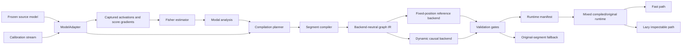

# Compiler architecture

## Status

This document describes the target architecture for turning the current
Fisher/modal experiments into a reusable compiler toolchain.

Two scopes are deliberately separate:

- **Current reference backend:** the checked two-layer toy transformer,
  fixed sequence length, exact activation Fisher analysis, position-indexed
  modal executors, algebraic fusion, and lazy instrumentation runtime.
- **Implemented compiler boundary:** model and activation adapters,
  heterogeneous layer specifications, variable-length calibration streams,
  adapter-owned segment execution, a strict model-level runtime manifest,
  canonical capability matching, and nonmutating mixed compiled/source
  dispatch.
- **Implemented dynamic-prefill scaffold:** length-independent Fisher
  projections, shared relative-position causal state, mixed-length boundary
  fitting, explicit compiled-site instrumentation metadata, and Fisher
  gradient collection through a mixed runtime.
- **Implemented external-model analysis diagnostic:** canonical multi-layer
  boundaries, bounded Fisher/transport moments, and frozen exact-logical-lag
  reverse-gradient prediction over adjacent edges and the block endpoint.
- **Implemented dense MLP-compaction primitive:** authenticated groupwise
  Fisher/output-aware \(K\rightarrow R\) coordinates, direct nonlinear
  generator distillation, exact singleton preservation, a strict
  source-free reduced-width executor, and raw rate-distortion/Pareto data
  structures. Its first Gemma layer-4 development run rejected direct
  synthesis on a reused nonconfirmatory guard, while its structure-aware
  native-pivot pruning control nearly met the strict margin at the same
  1,920-wide resource point. No fresh heldout or model-level quality result is
  implied. See
  [dense supermode compaction](dense-supermode-compaction.md).
- **Implemented full-model merge overlay:** all 36,864 Gemma MLP coordinates
  can enter the cross-block proxy search, retained native roots may fan out
  without an accepted-edge quota, and every selected consumer can be
  physically row-pruned in one complete native prefill. The first all-mode
  development run still found only one strict edge, saving 1,280 parameters;
  it is executor-breadth evidence, not a useful model-level compression
  result. See
  [whole-model selective mode bundling](cross-block-selective-bundling.md#all-mode-full-model-development-run).
- **Implemented modal-generator compiler path:** natural gated-MLP parameter
  groups, prompt-conditioned grouped Fisher coupling, axial parameter
  clustering, exact per-layer fragment lowering, Fisher-weighted affine
  computational-mode bases, coordinate generators, selected causal
  interactions, a checksummed end-to-end manifest, and all-at-once or
  incremental graph traversal are separate strict artifacts. Artifact hashes
  authenticate contents and declared lineage, while numerical extraction and
  split membership remain caller-declared and self-attested. The first live
  Gemma run physically replaced one 54-channel layer-17 fragment and recovered
  far more fidelity than matched deletion. The primary graph form saved 71,776
  net parameters; the separately fused isolated-node comparison saved 82,560.
  This is development-only single-fragment, edgeless-graph evidence, not
  whole-model compression. See
  [modal-generator compiler](modal-generator-compiler.md).
- **Conditional-computation reference:** per-token Fisher-need labels, a
  causal hard budget router, route-specific exact-cardinality mode masks,
  grouped modal execution, and static, position-only, and histogram-matched
  controls. The first rung is a native-output projection oracle, not an
  authenticated replacement executor.
- **Future production backend:** backend-neutral symbolic IR, efficient
  sliding-window kernels, cache-aware chunked prefill and decode,
  distributed/sharded Fisher accumulation, and additional model-family
  adapters.

The fixed backend remains the numerical regression oracle. Stages 1 and the
mixed-runtime core of stage 3 are implemented. Stage 4 now has an executable,
prefill-only trainable scaffold and adversarial sequence/runtime tests, but no
real transformer-layer dynamic artifact has passed end-to-end acceptance.
The modal-generator pipeline now supplies one concrete compiler orchestration
and executable graph IR. Efficient dynamic kernels, cache ownership, and a
validated multi-fragment external-model graph remain targets.

## Goals

The compiler should make it possible to:

1. analyze a frozen decoder model without changing its weights;
2. capture named activations and score gradients through a model-specific
   adapter;
3. estimate activation-space Fisher modes with an estimator appropriate to
   the model width;
4. compile selected layer ranges into inspectable modal graph executors;
5. validate every replacement locally and end to end;
6. mix compiled and original segments in the same model;
7. run arbitrary supported sequence lengths in prefill and decode;
8. use a compact fast executor for ordinary inference while loading the
   inspectable graph only when instrumentation or interventions are requested;
9. retain the original segment as a safe fallback when a compiled segment
   fails a shape, capability, provenance, or quality gate.

The first objective is a clean experimental platform. Producing a universally
faster implementation for every transformer family is not an initial goal.

## Current reference pipeline

The implemented toy pipeline is:

```text
ToyTransformer and grouped dataset
              |
              v
activation and score-gradient capture
              |
              v
exact width-wise empirical Fisher matrices
              |
              v
Fisher eigendecomposition and interventions
              |
              v
fixed-position modal layer executor fitting
              |
              v
discarded-mode conditional completion
              |
              v
two-layer composition and validation
              |
              v
algebraic seven-tensor fusion
              |
              v
compact runtime with lazy logical instrumentation
```

This path proves that the analysis, replacement, composition, fusion, and lazy
instrumentation ideas can work together. It intentionally uses small exact
objects:

- model width is 32;
- sequence length is eight unpadded positions;
- two known transformer layers are compiled;
- Fisher matrices are full `32 x 32` matrices;
- position means and causal kernels contain the fixed sequence dimension;
- artifact schemas know the exact toy executor structure.

Those properties make the current backend an excellent oracle, but they are
not suitable contracts for variable-length or large-model execution.

The conditional-budget milestone is a separate representation branch around
this pipeline. It uses an A-basis/A-router/B/validation/test protocol to ask
whether per-token modal need is predictable from a causal input boundary.
Hard routing evaluates one route-specific exact-budget subset per valid
token; masks are fitted from each need bin and are not required to be nested
prefixes. Static, position-only, and route-histogram-matched shuffled controls
isolate the routing effect. Because the current reference consumes the native
layer output, active modal accounting is not source-layer compute reduction.
See
[`conditional-computation.md`](conditional-computation.md) for the exact
oracle/executor boundary and the variable-sequence Gemma follow-up.

## Target system



The major boundaries are the model adapter, analysis API, compiler IR,
lowering backends, artifact manifest, and runtime. Model-specific details
should stop at the adapter. Backend-specific tensor layouts should stop at the
lowering and runtime layers.

## Core contracts

The following sketches describe responsibilities, not final Python signatures.

### `ModelAdapter`

```python
class ModelAdapter(Protocol):
    def model_spec(self) -> ModelSpec: ...
    def layer_specs(self) -> Sequence[LayerSpec]: ...
    def activation_sites(self) -> Sequence[ActivationSite]: ...
    def fingerprint(self) -> SourceFingerprint: ...
    def execution_fingerprint(self) -> str: ...

    def embed(self, batch: ModelInputs) -> HiddenBatch: ...
    def run_segment(
        self,
        layer_range: LayerRange,
        hidden: HiddenBatch,
        context: SequenceContext,
        cache: CacheView | None,
        capture: CapturePlan | None = None,
    ) -> SegmentResult: ...
    def project_logits(self, hidden: HiddenBatch) -> Tensor: ...
```

The adapter:

- enumerates ordered layers and stable semantic activation sites;
- translates generic sequence and cache inputs into the source model's call
  convention;
- exposes segment boundaries without copying or mutating source weights;
- captures activations and, when supported, their score gradients;
- reports dtype, device, cache, backward, and intervention capabilities;
- fingerprints source configuration and weights for artifact provenance;
- fingerprints live non-tensor execution options, so changing values such as
  an attention scale cannot silently retain compiled authorization.

The adapter does not estimate Fisher matrices, choose mode counts, fit an
executor, or define runtime fallback policy.

`ToyTransformerAdapter` is the first implementation. It delegates capture and
intervention to the existing explicit trace, preserves activation aliasing,
normalizes sequence inputs, exposes ordered layer/segment metadata, and
installs replacements atomically. Fisher collection and modal Jacobian
extraction now exercise this adapter path.

### Model and layer descriptions

```python
@dataclass(frozen=True)
class ModelSpec:
    architecture: str
    layer_count: int
    hidden_size: int
    vocabulary_size: int
    max_context: int | None
    numeric_policy: NumericPolicy
    capabilities: CapabilitySet


@dataclass(frozen=True)
class LayerSpec:
    index: int
    hidden_size: int
    attention: AttentionSpec | None
    normalization: NormalizationSpec
    feed_forward: FeedForwardSpec
    activation_sites: tuple[ActivationSite, ...]
```

Layer descriptions must be per-layer rather than inferred once for the whole
stack. Large decoders may alternate attention policies, use different
positional rules by layer type, and have query/KV dimensions that cannot be
derived from hidden size alone.

Activation sites use semantic roles such as `block.input`,
`attention.output`, and `block.output`. Adapters map these roles to native
module paths. Compiler artifacts refer to semantic IDs plus the source
fingerprint instead of relying on Python class names.

### Sequence semantics

```python
@dataclass(frozen=True)
class SequenceContext:
    query_valid_mask: Tensor
    key_valid_mask: Tensor
    logical_positions: Tensor
    key_logical_positions: Tensor
    cache_positions: Tensor | None
    phase: Literal["prefill", "decode"]
    input_origin: SequenceInputOrigin
    cache_state: object | None = None
    adapter_payload: object | None = None
```

The core tensor axes are symbolic:

```text
B = batch
Q = query tokens processed by this invocation
K = visible cached and current key tokens
D = hidden width
```

A segment consumes and produces `[B, Q, D]`; it must not treat `Q` as the
model's maximum context.

`logical_positions` determine positional encoding. `MaskPolicy` plus
tensor/cache order determine causal and window visibility according to the
model family; arbitrary RoPE IDs do not silently redefine token order.
`cache_write_slots` identify physical storage. They are separate because a
simple dense cache may use `slot == position`, while a sliding, ring, or paged
cache generally does not.

`MaskPolicy` is a semantic composition, for example:

```text
Causal
Causal AND SlidingWindow(1024)
Causal AND ValidTokens
Causal WITH BidirectionalSpans(image_spans)
```

The IR must not require a dense `[B, 1, Q, K]` mask. A backend may lower the
policy to an additive bias, boolean mask, sparse descriptor, or fused kernel.

### Cache semantics

```python
@dataclass(frozen=True)
class CacheSpec:
    layer_id: int
    policy: Literal["global", "sliding"]
    kv_heads: int
    head_dim: int
    capacity: int | None
    window_size: int | None
    dtype: DType
    device: DevicePlacement
    layout: str
```

The model runtime, not an individual compiled segment, owns cache lifetime.
Every original or compiled segment receives compatible per-layer cache views.
This allows:

- multi-token and chunked prefill;
- single-token decode;
- global append-only caches;
- bounded sliding caches;
- backend-specific dense, ring, or paged layouts;
- cache reordering or forking when a decoding strategy requires it;
- compiled and original segments to alternate without rebuilding state.

Prefill and decode equivalence is a validation property: processing a sequence
in one prefill, chunked prefills, or prefill plus token-by-token decode must
produce equivalent logits within the declared numeric tolerance.

### Numeric and placement policy

A single `dtype` field is insufficient. `NumericPolicy` records at least:

- parameter storage dtype and quantization format;
- activation compute dtype;
- normalization and reduction accumulation dtype;
- Fisher accumulation dtype;
- KV-cache dtype;
- output dtype;
- device/backend placement;
- tensor-layout or sharding constraints that affect compatibility.

Analysis and deployment capabilities are separate. A quantized inference
adapter may not provide usable autograd, so compilation may use a
full-precision analysis replica with the same source identity and deploy the
result against a quantized runtime only after an explicit compatibility gate.

## Analysis architecture

### Calibration input

Analysis consumes an iterable calibration stream, not one fixed in-memory
tensor. Each batch contains:

- tokens or input embeddings;
- `SequenceContext`;
- targets and a loss mask;
- stable example IDs for grouped splits and reproducibility;
- optional modality metadata.

Train, selection, and final evaluation data remain separated. No test data may
select an estimator, mode count, executor width, or validation threshold.

### Fisher estimators

```python
class FisherEstimator(Protocol):
    def update(self, activations: Tensor, score_gradients: Tensor, mask: Tensor): ...
    def finalize(self) -> FisherSummary: ...
```

Supported implementations should be capability-driven:

- `ExactFisher` for the toy reference;
- streaming covariance accumulation;
- randomized top-rank eigensolvers;
- blockwise or sketched approximations;
- distributed/sharded accumulation.

The estimator owns numerical accumulation and approximation error reporting.
The modal analysis consumes `FisherSummary`, not estimator-specific state.
This prevents the compiler from assuming a materialized `D x D` matrix at
large width.

### Reverse-causal modal transport diagnostic

`StreamingCausalModalTransportEstimator` tests one specific failure mode of a
row-local gradient map. For a forward segment from boundary \(a\) to boundary
\(b\), it predicts the upstream modal score gradient from same-position and
later downstream rows:

\[
\widehat z^{(g)}_{a,s}
=
\sum_{\delta=0}^{L} z^{(g)}_{b,s+\delta}W_\delta .
\]

Rows are grouped by sequence and matched by exact `logical_positions`.
Padding, sparse masks, and gaps are not compressed into synthetic neighbors.
The estimator also receives the segment's composed structural visibility: a
pure sliding segment has visibility
\(1+\sum_\ell(\mathrm{window}_\ell-1)\), while a segment containing a global
layer is unbounded. Features outside that visibility remain zero.

One maximum-lag replay supplies nested rank and lag-prefix fits. For modal
rank \(k\) and maximum lag \(L\), the retained FP64 statistics are a
`[(L + 1)k, (L + 1)k]` feature Gram, a `[(L + 1)k, k]` feature/target
cross-moment, and a `[k, k]` target Gram. Their storage is independent of
sequence count and length. The lag-0 ridge map is solved independently and is
the comparison baseline for every larger lag window. Calibration fits are
frozen before a separate validation moment replay.

The Gemma trajectory rung applies this diagnostic to every adjacent canonical
boundary pair and to the block endpoint. The fitted \(W_\delta\) are pooled
predictive coefficients, not measured per-position Jacobian blocks. The
analysis has no context conditioning and does not implement a forward graph.
Accordingly, even a positive held-out gain would be evidence for a compact
relationship to model next—not executor acceptance or compilation proof.

### Activation-aware forward-Jacobian reference

`StreamingActivationCovariance` complements the Fisher estimator with the
distribution of real activation displacements. `LinearActivationCodec`
supports three full-width coordinate policies:

- native Fisher order;
- Fisher vectors reordered by eigenvalue times modal activation variance;
- regularized generalized Fisher coordinates with dual encoder and decoder.

Every codec audits \(ED^{\mathsf T}=I\), so full width remains an explicit
identity path even when the generalized basis is not orthogonal in residual
coordinates. Rank-deficient covariance or Fisher state requires recorded
positive floors rather than an implicit pseudoinverse.

`collect_block_causal_lag_jacobian` is distinct from the reverse-gradient
diagnostic. It excites a codec decoder direction, executes the frozen source
block under a true JVP, and projects through the output codec encoder. It
keeps signed mean and RMS edges by exact logical lag, separately measuring
future-position leakage, omitted past energy, and within-lag variation. RMS
is never executable. A large variation fraction is the evidence needed before
adding a causal router and multiple signed experts.

`factor_causal_weighted_jacobian` builds an independent SVD for each output
prefix:

\[
F_t^{1/2}
\begin{bmatrix}
J_{t,0}C_0^{1/2}&\cdots&J_{t,t}C_t^{1/2}
\end{bmatrix}.
\]

Independent prefixes make causality structural: output \(t\) has no factor
slot for a source later than \(t\). The result retains signed execution
factors, exact SVD-tail energy, PSD-support accounting, analytic coefficient
and MAC counts, and a strict weights-only round trip. Version 1 deliberately
uses block-local \(C_s\) and \(F_t\); it omits cross-position metric blocks.

The Gemma pilot expands pooled lag means into a small \(T=L+1\) stationary
Toeplitz reference. Its SVD spectrum and discarded-tail accounting are exact
under the chosen pooled, replicated metric; a truncated factor is still an
approximation, and the reference is not a full state-conditioned Jacobian. Its
dense ratio compares with an unshared causal tensor, not a natural lag-shared
kernel, the source model, or an optimized backend.

### Residual-separated gated causal executor

`ResidualGatedCausalModalExecutor` is the executable follow-up to the
stationary weighted-Jacobian reference. For modal input \(x_t\), it separates
the local path from positive-lag transport:

\[
y_t
= x_tW_{\mathrm{same}}+b
+\sum_{s<t}\sum_e
p_e(x_t,x_s,\log(1+t-s))(x_sU_e)V_e.
\]

An optional exact modal skip belongs only to the same-position path.
Positive-lag experts are shared and low rank. Their small router uses query
state, source state, and relative logical lag; it has no absolute-position or
position-pair table. Runtime parameter shapes are therefore independent of
sequence length. The executor accepts distinct query/key validity masks and
logical positions, excludes equal/future positions structurally, and may
apply a maximum positive-lag budget.

The reference exposes local output, cross-token output, legal-edge masks, and
router probabilities separately. Its accounting includes every soft-mixture
expert on each legal edge. The reported ideal sparse MAC count excludes
nonlinearities, softmax, masking, additions, and memory traffic, so it cannot
authorize a latency or kernel-speed claim.

The Gemma runner keeps the raw residual \(h_{\mathrm{in}}\) as an exact bypass
and asks this graph to predict only the layers 4–6 block delta through a
retained output decoder:

\[
\widehat h_{\mathrm{out}}
=h_{\mathrm{in}}
+\operatorname{Executor}\!\left(
(h_{\mathrm{in}}-\mu_{\mathrm{in}})E_{\mathrm{in},:r}
\right)D_{\mathrm{out},:r}^{\mathsf T}.
\]

This avoids treating two generalized-Fisher gauges as interchangeable.
Calibration A fits a fixed update schedule; calibration B locks one
predeclared rank/expert configuration; validation evaluates that lock once;
reserved test remains hash-only. A diagnostic fallback is still locked when
no candidate passes, but it is marked nonviable before validation.

The current PyTorch experiment executes the source block to capture its
reference output and then intervenes at the final boundary. Its accounting is
for a hypothetical replacement, not the wall-clock work of the diagnostic.
Authentication into the mixed compiled runtime remains a separate gate.

### Target-informed projection rank ladder

The projection ladder is a fail-closed representation diagnostic between
codec selection and executor fitting. For each retained output-decoder prefix,
it solves the block-delta coordinates independently at every valid token,
intervenes once at the block output, and measures downstream NLL and top-1
agreement. Because the coordinates use the true native block output, this
isolates span sufficiency from graph-generation error but is not an executable
replacement.

The protocol strict-binds the weighted-codec and negative gated-executor
artifacts before model load. Calibration B sees the preregistered rank curve;
direct reconstruction metrics are diagnostic only. A full-width identity
failure stops the run before validation. Otherwise the smallest reduced rank
passing both behavior gates is locked, or full-width identity is locked with
`selection_failed=true`. Validation sees exactly one locked-rank
intervention. Calibration A and reserved test remain hash-only.

This distinction belongs in the future planner:

```text
output-span diagnostic passes?
        | yes                         | no
        |                             v
        |                       change/reorder the span
        |                             |
        |                             v
        |                       lock rotated span
        |                             |
        +-------------+---------------+
                      |
                      v
          fit executor inside locked span
                      |
                      v
          authenticate replacement
```

Neither target-informed projection nor retained rank alone authorizes
parameter, arithmetic, storage, or latency claims. Those claims begin only
after a source-independent executor reproduces the accepted span.

### Codimension-one tail-span diagnostic

The codimension-one diagnostic implements the `change/reorder the span`
branch. It consumes the strict negative projection-ladder artifact, which
already binds the weighted-codec and gated-executor predecessors, plus a new
source-disjoint four-way prompt protocol. Calibration A fits one omitted
Euclidean direction inside the 32-dimensional complement of the existing
rank-608 decoder prefix. Its sensitivity operator balances a downstream
pseudo-top-1 score-gradient Fisher with the native block-delta second moment.
The source codec's omitted rank-639 direction remains a same-rank control.

Calibration B compares the fitted rotation, the original codec-prefix
rank-639 span, and mandatory rank-640 identity using only aggregate NLL and
top-1 gates. An unstable calibration-A fit stops before calibration B; a
failed full-width identity stops before validation. If neither reduced span
passes calibration B, the runner saves a selection-failure artifact without
tokenizing validation. Otherwise it locks one reduced span and evaluates
exactly that intervention on validation. Reserved test prompts are parsed and
hashed only; they never select the direction, the span, or a threshold and
are not model-evaluated.

The pinned layers-4–6 result demonstrates that basis ordering can rescue the
same rank. On calibration B, the rotated rank-639 span passed at
+0.000382 delta NLL/token and 0.9843 top-1 agreement, while the original
codec-prefix rank-639 control failed at +0.016279 and 0.9303. The locked
rotation then validated at +0.000316 delta NLL/token and 0.9913 top-1
agreement. This is a positive representation result: the earlier rank-639
failure was not evidence that every one-dimensional omission was harmful.

The intervention still reads the true native block delta after executing the
source layers. It removes only one of 640 coordinates and supplies no
source-independent computation. The follow-up did train a graph executor
inside that span and truly skipped native layers 4–6. Its structural
accounting was small—about 5.27% of the source block's stored coefficients and
5.22% of its ideal analytic MAC estimate—but it failed calibration-B fidelity
at +0.0611 delta NLL/token and 0.6533 top-1 agreement. The rotated oracle still
passed. The next compiler step is therefore a more precise generator, not
another proof that the span exists.

## Compiler architecture

### Planning

`CompilationPlan` records:

- source model and adapter identity;
- requested layer segments;
- activation boundaries;
- Fisher estimator and retained-mode policy;
- executor backend and shape constraints;
- fit/selection data identities;
- validation thresholds;
- fallback policy.

Segments are independent compilation units. A plan may compile one layer,
several adjacent layers, or a prefix while retaining all other original
layers.

### Intermediate representation

The graph IR represents modal computation without a fixed runtime layout. It
needs:

- typed symbolic tensor axes;
- activation projection and reconstruction;
- causal or masked mixing;
- nonlinear transforms;
- discarded-mode completion;
- residual composition;
- named capture and intervention points;
- source-boundary and basis provenance;
- shape and backend capability guards.

Position-specific tables are legal in the current reference dialect, but are
marked with an exact-length guard. The dynamic dialect uses shared relative or
stateful causal operators whose parameters do not grow with a particular
sequence length.

### Lowering backends

#### Fixed-position reference backend — current

This backend retains the existing behavior:

- exact supported sequence length;
- position-conditioned means and normalization;
- independently parameterized position-coupled causal kernels;
- current modal completion and composition;
- monolithic and seven-tensor fusion;
- an opt-in packed causal-pair specialization derived from the authenticated
  seven-tensor runtime;
- lazy loading of the logical instrumentation graph.

It is the correctness oracle for refactoring. It should fail a shape guard
instead of silently accepting a different length.

The authenticated dense lazy runtime remains the default executor and the
instrumentation oracle. The packed specialization stores and evaluates only
the legal lower-triangular position pairs, but deliberately carries no
sidecar: capture and intervention requests must return to the dense lazy
runtime. It is currently a validation-gated, in-memory candidate rather than a
serialized runtime ABI. The generic PyTorch lowering wins narrowly at batch 1
on the recorded CPU and loses at larger batches because gather, temporary
pair-output, and indexed-reduction overhead exceed the saved multiplies. A
custom MLX/Metal lowering now schedules those triangular blocks directly, but
its first scalar-thread kernel remains experimental because measured latency
is only at parity with dense MLX.

#### Packed triangular MLX/Metal kernel — experimental implementation

`MLXPackedTriangularFusedTwoLayerModalStack` implements both an ordinary MLX
reference graph and a custom `mx.fast.metal_kernel` path. Conversion begins
from the authenticated PyTorch packed runtime, verifies canonical target-major
causal-pair order, copies the seven float32 tensors into MLX-owned state, and
hash-checks the result. The runtime state becomes immutable before compiled
execution; exported state arrays are non-aliasing copies.

For a target position \(t\), its packed block row begins at \(t(t+1)/2\) and
contains only source positions \(0 \ldots t\). The current Metal kernel assigns
one thread to each `(batch, target, output feature)` and:

1. load the source activation tile and its packed coefficient tile;
2. accumulate in FP32 without materializing gathered position pairs;
3. add the target-position bias and fuse GELU before writing the next stage;
4. repeat for the bridge contraction, then apply the position-local decoder.

This schedule needs neither the reference implementation's pair-output tensor
nor `index_add`, so target rows have exclusive ownership and require no
atomics. At larger sequence lengths, the same idea becomes block-triangular:
use dense tiles below the causal diagonal and a masked diagonal tile so matrix
hardware remains well utilized. The current flattened offsets are 32-bit and
are guarded before launch; a larger-model lowering must tile or adopt wider
index arithmetic before it can exceed that bound.

The kernel object is constructed once and reused because MLX custom Metal
kernels are JIT compiled. `mx.compile` wraps both the ordinary reference and
custom-Metal fast paths. Capture requests use the ordinary differentiable MLX
graph; the authenticated PyTorch path remains the activation-Fisher oracle,
and the Metal path is inference-only. MLX activation interventions are not yet
supported.

The checked Apple M5 benchmark forces every lazy result with `mx.eval` and a
device synchronization, uses one-second minimum warmups, and rotates nine
measurement rounds. Custom Metal was 2.294x–2.786x faster than the ordinary
packed MLX graph and 0.915x–1.090x the dense compiled MLX path across batches
1, 8, 64, and 256. Its geometric-mean speedups were 2.555x versus ordinary
packed and 1.007x versus dense. This removes the packed implementation
overhead, but does not yet establish a meaningful win over optimized dense
contractions at the toy shape. First-observed calls are recorded separately
but are not process-isolated cold-start measurements.

The next performance rung is cooperative output-feature tiling with
threadgroup memory, followed by a block-triangular kernel for longer sequences.
Any such change must retain the ordinary MLX and PyTorch numerical oracles,
the validation behavior gates, immutable provenance, and the synchronized
same-device benchmark contract.

#### Dynamic causal backend — prefill scaffold implemented

`VariableLengthCausalModalExecutor` now uses pooled Fisher projections and a
bank of exponentially decayed relative-position states. Its learned tensor
shapes are independent of sequence length. The current implementation:

- supports padding and ragged batches;
- accepts arbitrary logical position offsets;
- supports global and bounded sliding visibility;
- rejects negative or nonmonotonic valid positions;
- exposes trace/intervention points for modal input, causal state, hidden
  routing, modal output, and residual output;
- executes full prefill only, with no cache ownership or decode support.

For equal query/key positions and masks under global causality, execution uses
a Python recurrence with linear state size. Sliding windows or distinct
query/key positions/masks currently lower to dense `[B,Q,K,C]` decay weights,
so that path is quadratic and is not yet suitable for Gemma-scale contexts.
An efficient scan or ring/subtractive recurrence and a fused kernel remain
required.

A length-specialized fused kernel may sit beside the generic dynamic executor.
Runtime guards select it only when its constraints match.

### Validation gates

Compilation does not imply acceptance. Each segment must pass:

1. **Structural checks:** shapes, causality, mask policy, dtype, device,
   provenance, and immutability.
2. **Local equivalence:** original and compiled segment receive identical
   boundary activations and sequence context.
3. **End-to-end behavior:** accuracy, NLL, correct-token probability, output
   KL, and logit-margin drift.
4. **Progressive composition:** measure the model after each additional
   compiled segment so error accumulation is localized.
5. **Sequence checks:** trained and unseen lengths, padding patterns, position
   offsets, and local-window boundaries.
6. **Cache checks:** full prefill, chunked prefill, and decode equivalence.
7. **Instrumentation checks:** named captures and interventions agree with the
   logical executor; ordinary fast inference performs no sidecar load.
8. **Performance checks:** resident bytes, sidecar bytes, latency, and
   arithmetic counts are reported without replacing quality gates.

A failed segment remains original. Validation never authorizes fine-tuning
neighboring transformer layers.

## Artifact and runtime architecture

### Runtime manifest

A model-level manifest contains:

- format and compiler versions;
- source model, configuration, tokenizer, and weight fingerprints;
- adapter identity and semantic activation schema;
- segment ordering and original/compiled status;
- sequence and mask capabilities;
- numeric, device, layout, and cache policies;
- modal-basis and calibration provenance;
- fast tensor artifacts and inspectable sidecars;
- validation measurements and tolerances;
- fallback requirements.

Manifests are model-level, while tensor payloads and sidecars may remain
segment-level. This permits independent compilation and replacement.

### Mixed runtime

```text
embedding
    |
compiled segment 0
    |
original segment 1
    |
compiled segment 2
    |
original remainder
    |
output projection
```

The runtime dispatches each segment under the same `SequenceContext` and cache
owner. A compiled artifact whose guard does not match falls back to its
original segment when available.

`MixedSegmentDispatcher` implements this plan for prefill today. It resolves
all guarded paths before execution, never retries source fallback after a
compiled executor has begun, normalizes residual boundaries to a contiguous
ABI, and requires dtype/device preservation. Capability matching is
three-valued (`match`, `mismatch`, `unknown`); unknown manifest or backend facts
never authorize compiled execution. Instrumentation ownership comes from
adapter activation metadata and each binding's declared compiled sites, so a
multi-layer segment's backend-native taps are routed without name-prefix
guessing.

Strict mode carries the compiler-time adapter execution fingerprint in the
trusted runtime identity and executor binding. Each binding also carries
compiler-time fingerprints for its fast and inspectable executor objects.
The dispatcher measures the loaded objects independently, then re-fingerprints
source tensor state, live adapter execution options, and compiled executor
state at every compiled boundary. This closes both pre-binding drift and
mutations caused by earlier source work or interventions. The request's normalized
sequence tensors and metadata are snapshotted and checked after each segment,
so masks or positions cannot silently change beneath a preflight decision.
The capture/intervention plan is snapshotted as well, preventing an earlier
callback from expanding a later executor's authorized instrumentation surface.
Late integrity failures are fail-stop, never fallback/retry. The explicit
`trusted_immutable` mode skips repeated model/executor state hashing and is
safe only behind an authenticated loader that owns and freezes those objects;
sequence immutability remains enforced.

`InstrumentedModelBinding` attaches explicit `ActivationSite` metadata to the
mixed runner. `collect_instrumented_score_gradients` can then compute the same
activation-space Fisher samples for compiled modal taps without inferring
their axes or widths from strings.

The two execution modes remain:

- **Fast mode:** compact, pre-folded tensors for ordinary inference.
- **Inspectable mode:** provenance-checked logical modal graph loaded lazily
  for activation capture or interventions.

Lazy instrumentation is a representation switch. It is not a policy that
loads low-Fisher modes only when the model becomes uncertain.

## Gemma 3-class decoder requirements

Gemma 3 is a useful target because it exercises nearly every abstraction above
without requiring a mixture-of-experts runtime.

### Heterogeneous attention

Gemma 3's text decoder uses grouped-query attention, QK normalization, and
pre/post RMSNorm. Its layer pattern repeats five local sliding-attention
layers followed by one global-attention layer, starting with a local layer.
The local-window value is checkpoint-specific, so the adapter reads it from
the loaded text configuration rather than inferring it from model size.
Consequently:

- attention scope and window are per-layer configuration;
- query heads, KV heads, head dimension, and query scaling are independent
  fields;
- normalization and residual topology are adapter metadata;
- a compiler must not infer the whole stack from its first layer.

Sources:

- [Gemma 3 Technical Report](https://storage.googleapis.com/deepmind-media/gemma/Gemma3Report.pdf)
- [Official Gemma 3 270M configuration](https://huggingface.co/google/gemma-3-270m/blob/main/config.json)
- [Official Gemma PyTorch configuration](https://github.com/google/gemma_pytorch/blob/main/gemma/config.py)
- [Official Gemma PyTorch model](https://github.com/google/gemma_pytorch/blob/main/gemma/model.py)

### Positions, masks, and long context

Gemma 3 uses separate RoPE policies for its attention types: a base wavelength
of 10,000 for local layers and 1,000,000 for global layers, with long-context
position scaling/interpolation. The 270M and original 1B models support 32K
tokens; the larger original variants support 128K.

The sequence contract must therefore:

- carry logical positions explicitly;
- allow a layer to select its own positional policy;
- preserve arbitrary prefill offsets during decode;
- compose causal, local-window, padding, and modality mask rules;
- avoid dense maximum-context mask artifacts.

The official implementation explicitly selects local/global rotary tables,
passes local and global masks, and writes per-layer K/V caches at input
positions.

Sources:

- [Gemma 3 Technical Report](https://storage.googleapis.com/deepmind-media/gemma/Gemma3Report.pdf)
- [Google's Gemma 3 architecture explainer](https://developers.googleblog.com/en/gemma-explained-whats-new-in-gemma-3/)
- [Official Gemma PyTorch model](https://github.com/google/gemma_pytorch/blob/main/gemma/model.py)

### Cache behavior

The reference runtime maintains a K/V pair for every decoder layer, with KV
head count and head dimension taken from configuration. It uses multi-token
prefill and then one-position updates during decode.

For a scalable compiler:

- cache state is an explicit segment input/output;
- cache specs are heterogeneous by layer;
- local caches may be bounded or circular while global caches preserve the
  long context;
- physical cache layout is backend-specific;
- compiled and original layers must consume compatible logical state.

Google reports material CPU and GPU latency improvements from changing KV
cache layout, reinforcing that layout is a runtime capability rather than an
incidental tensor shape.

Sources:

- [Official Gemma PyTorch model](https://github.com/google/gemma_pytorch/blob/main/gemma/model.py)
- [Gemma 3 on mobile and web](https://developers.googleblog.com/en/gemma-3-on-mobile-and-web-with-google-ai-edge/)

### Numeric formats and devices

Google's reference configuration supports FP16, BF16, and FP32 storage, with
BF16 as the usual large-model default. The reference attention softmax and
RMSNorm use FP32 computation before casting back. The PyTorch implementation
also supports int8 weights, and Google publishes int4 quantization-aware
trained Gemma 3 variants.

The official runtimes target CPU, CUDA GPU, and PyTorch/XLA devices including
TPU; optimized Gemma deployments also target mobile CPU and GPU.

Implications:

- storage, compute, reduction, Fisher, and cache dtypes are distinct;
- quantization metadata and scales belong in the model/artifact contract;
- device and tensor layout are opaque capabilities, not CUDA booleans;
- validation tolerances are attached to a numeric policy;
- Fisher analysis may require a differentiable higher-precision replica even
  when deployment uses quantized weights.

Sources:

- [Official Gemma PyTorch repository](https://github.com/google/gemma_pytorch)
- [Official Gemma PyTorch configuration](https://github.com/google/gemma_pytorch/blob/main/gemma/config.py)
- [Gemma 3 QAT model release](https://developers.googleblog.com/en/gemma-3-quantized-aware-trained-state-of-the-art-ai-to-consumer-gpus/)

### Multimodal boundary

The 270M and 1B Gemma 3 models are text-only. The original 4B, 12B, and 27B
models add a SigLIP vision encoder and projector. Images enter the language
decoder as 256 projected soft-token vectors, and image-token regions use
bidirectional attention while generated text remains autoregressive.

The initial compiler should not absorb the vision encoder. Its decoder input
boundary should nevertheless support:

- token IDs or precomputed input embeddings;
- modality spans and embedding provenance;
- mask policies with bidirectional image spans inside an otherwise causal
  sequence.

This makes Gemma 3 270M the clean first integration target, followed by 1B.
The same decoder adapter can later accept projected image tokens for a larger
variant without redesigning sequence semantics.

Sources:

- [Gemma 3 Technical Report](https://storage.googleapis.com/deepmind-media/gemma/Gemma3Report.pdf)
- [Google's Gemma 3 architecture explainer](https://developers.googleblog.com/en/gemma-explained-whats-new-in-gemma-3/)

## Staged migration

Each stage keeps the previous stage executable and must pass its validation
suite before broadening scope.

### Stage 0: lock the reference — complete

- Preserve current toy artifacts, reports, numerical gates, and lazy runtime.
- Treat the current fixed-length behavior as a compatibility fixture.
- Record exact source and artifact schema versions.

### Stage 1: introduce contracts around existing behavior — core implemented

- Add immutable layer, activation-site, and sequence descriptions.
- Implement `ToyTransformerAdapter` by delegation.
- Route one existing analysis run through the adapter.
- Require zero numerical change and no rewrite of legacy artifacts.
- Remaining: make numeric policy and capability metadata explicit rather than
  inferring them from adapter methods and tensor state.

### Stage 2: add compiler orchestration

- Introduce `FisherEstimator`, `CompilationPlan`, `CompiledSegment`, and
  validation-result interfaces.
- Provide one orchestration API and CLI over the existing experiment stages.
- Continue lowering exclusively to the fixed-position reference backend.

### Stage 3: generalize depth and manifests — runtime core implemented

- Replace the special two-layer runtime schema with an ordered N-segment
  manifest. This schema and a nonmutating wrapper for the checked runtime are
  implemented.
- Support mixed original and compiled segments. The prefill dispatcher,
  guarded fallback, full source runtime, and multi-layer compiled-site routing
  are implemented.
- Remaining: compile several toy depths and seeds without per-checkpoint code
  changes.
- Remaining: validate every progressive compiled prefix.

### Stage 4: implement the dynamic sequence backend — partial

- Implemented: shared relative/stateful causal parameters independent of
  sequence length.
- Implemented: padding, sparse-mask, offset, position-gap, distinct query/key,
  causality, and local-window-boundary tests.
- Implemented: detached source-boundary batch contracts, valid-position
  weighted fitting, best-selection checkpoint restoration, and per-length
  reports.
- Remaining: symbolic backend-neutral `B/Q/K` IR and lowering.
- Remaining: collect real toy-transformer boundary pairs, select without test
  leakage, serialize provenance, and pass local plus end-to-end held-out-length
  gates.
- Remaining: replace the quadratic sliding/distinct-position path and Python
  recurrence with scalable kernels.

### Stage 5: add cache-aware prefill and decode

- Make cache state and physical placement explicit.
- Validate full prefill, chunked prefill, and token decode equivalence.
- Support both global and bounded sliding cache policies.
- Exercise mixed compiled/original execution with one cache owner.

### Stage 6: scale Fisher analysis — partial

- Implemented: a deterministic Frequent Directions estimator with bounded
  `O(sketch_rows * hidden_width)` state, exact total score-gradient trace,
  pooled activation means, and serialization-safe low-rank results.
- Implemented: per-sequence summed-NLL collection through the generic
  `InstrumentedModel` contract, including detached-leaf suffix
  differentiation for frozen large models.
- Implemented: exact-versus-streaming small-model tests, chunk stability, PSD,
  zero-gradient, mask, dtype, and state-round-trip checks.
- Implemented: a reusable transient per-sequence activation/score-gradient row
  stream, sign- and rotation-invariant principal-angle stability curves, and
  exact bounded-memory held-out Rayleigh replay in frozen mode prefixes.
- Implemented: canonical contiguous-block boundary plans that omit adjacent
  output/input aliases, multi-depth Fisher geometry, \(O(k^2)\) paired modal
  moments, calibration-frozen whitened Procrustes transports, and exact
  streaming held-out transport residuals.
- The uncentered reverse-gradient transport is scored as zero-baseline
  explained energy, not mean-centered \(R^2\). The Procrustes member pairs
  equal sequence positions and therefore remains the historical row-local
  comparison.
- Implemented: exact-logical-lag reverse-causal ridge moments with sequence
  isolation, sparse-position protection, composed finite visibility, nested
  lag/rank prefixes, an independently refit lag-0 baseline, and calibration-
  frozen validation evaluation. The diagnostic covers adjacent edges plus the
  whole block endpoint and retains bounded sufficient statistics rather than
  sequence rows.
- Implemented: Gemma trajectory artifact version 2 binds those causal moments,
  frozen maps, evaluations, and scalar curves into the strict two-way
  tensor/report validation path. The loader remains compatible with version 1
  row-local artifacts and does not synthesize causal results for them.
- Implemented: streaming FP64 activation covariance plus native,
  variance-weighted, and regularized generalized Fisher codecs with strict
  full-width dual-identity and serialization audits.
- Implemented: a bounded true-forward-JVP block probe with exact logical-lag
  causality, observed-pair energy accounting, stationary-versus-varying edge
  decomposition both per lag and with lag zero excluded, projected-slice
  scope labels, and codec provenance binding.
- Implemented: independent causal-prefix
  \(F_{\rm out}^{1/2}JC_{\rm in}^{1/2}\) SVDs, signed support-aware execution
  factors, optimal tail curves, analytic coefficient/MAC counts, and strict
  weights-only loading.
- Remaining: representative and sequence-balanced prompt protocols,
  predeclared acceptance/reporting orchestration, automated cross-sketch
  convergence, per-example and per-length-bucket influence diagnostics,
  approximation residuals, cross-position covariance metrics, scalable
  context-conditioned causal diagnostics, and sharded accumulation.

### Stage 7: attach an external text decoder — span rescued, executable compression unproven

- Implemented: a structural, text-only Hugging Face Gemma 3 causal-LM adapter
  with heterogeneous layer metadata, residual-boundary capture and
  intervention, explicit segment primitives, and atomic layer replacement.
- Implemented: an opt-in `google/gemma-3-270m` one-layer Fisher CLI with
  license/auth instructions, external-cache enforcement, ignored local
  outputs, and a tracked-file model-payload audit.
- Implemented: model weights remain frozen and external; the saved artifact
  contains only pooled activation centers, low-rank Fisher modes, exact trace
  accounting, and provenance.
- Implemented: a strict diagnostic split schema, calibration-A/B/full
  extraction, rank-wise subspace geometry, exact validation replay, and
  explicit reporting that thresholds are undefined and the reserved test
  prompts are not model-evaluated.
- Implemented: an analysis-only layers-4–6 trajectory rung spanning
  sliding/global/sliding attention. It captures four unique boundaries in one
  backward per sequence, fits activation and reverse-gradient modal maps on a
  calibration replay, evaluates frozen maps on validation, tracks per-prompt
  influence, and keeps test hash-only. Its gradient validation quantity is the
  zero-baseline explained fraction. It now compares an independently fit
  lag-0 ridge baseline with exact future-logical-lag windows on each adjacent
  edge and the block endpoint, subject to composed attention visibility.
- A developer-local diagnostic exercised the full analysis path, but its short
  template-matched prompts and prompt-sensitive bases do not authorize a rank
  or compilation claim. In the block diagnostic, the two earliest boundaries
  passed the rank-128 capture floor but failed the rank-96 floor; activation
  transport generalized much better than score-gradient transport. The
  tracked classification is therefore
  `inconclusive_basis_not_identifiable`, not a rotation claim. No live result
  artifact is committed.
- The pinned version-2 causal rerun also found no held-out gain from lag 1 or
  lag 4 over lag 0 at rank 128 with relative ridge 0.01. Calibration explained
  energy rose to roughly 0.97–0.98 at lag 4 while every lag-4 validation value
  was negative; lag-4 condition numbers were approximately
  \(4.75\times10^5\)–\(6.98\times10^5\). This rejects the current stationary
  homogeneous exact-lag ridge protocol, not sequence-aware executors in
  general. The ignored strict-loaded payload was approximately 56 MB with a
  987 KB JSON report.
- Implemented: a four-way split-safe activation-aware rung. Calibration A fits
  covariance/Fisher codecs; calibration B first requires every family's own
  full-width behavioral identity and then locks the first reduced rank/family
  passing predeclared aggregate gates. Validation sees only that locked choice,
  its family's full-width identity, and the native identity; test remains
  hash-only. The artifact cross-binds the optional true JVP to its codecs and
  regenerates the merged weighted factor during strict loading.
- A pinned local run selected a regularized generalized codec at joint rank
  636. Calibration B delta NLL/token was -0.003316 with 0.9643 top-1
  agreement; locked validation was +0.010285 with 0.9626 agreement. Both the
  locked generalized-family and native validation identities were within
  \(6.58\times10^{-8}\) NLL/token with exact top-1. This is a positive
  node-selection result on 16 short, previously explored validation prompts,
  not useful compression: it removes only four of 640 coordinates at each of
  three sites and does not execute a replacement block.
- The four-sequence, 4-by-4 projected modal slice, lag-0–4 forward pilot
  attributed 95.67% of aggregate captured energy to its stationary signed lag
  mean, but the aggregate was dominated by lag zero. Positive lags were only
  34.93% stationary and 65.07% varying, with zero future leakage. Its rank-two
  synthetic Toeplitz factor retained 97.30% of the chosen weighted energy and
  used 160 MACs versus 240 for the explicitly unshared dense reference, but
  99.83% of that synthetic energy was at lag zero and a natural lag-shared map
  stores only 80 coefficients. No full-Jacobian, parameter, FLOP, storage,
  latency, or variable-length claim follows.
- Implemented: a residual-separated gated causal modal executor with
  variable-length masks/positions, an independent same-position affine path,
  low-rank positive-lag experts, state-and-relative-lag routing, inspectable
  path outputs, exact future-edge exclusion, analytic accounting, and strict
  weights-only loading.
- Implemented: a source-disjoint four-way Gemma runner. It keeps the raw input
  residual as an exact bypass, fits the block delta on calibration A, locks
  among ranks 320/480 and one/two-expert candidates on calibration B, evaluates
  that lock once on validation, and leaves test hash-only. Identity,
  full-width codec round-trip, frozen-weight, prompt-disjointness,
  causality, padding, and artifact controls pass.
- The pinned run found no viable candidate. Its required diagnostic fallback
  was rank 320 with two rank-16 experts and a width-16 router. Validation
  block-delta NRMSE was 0.823388 with cosine 0.605518; delta NLL/token was
  +7.015665 and top-1 agreement was 0.07381. Stored coefficients were 3.2518%
  of the source block's parameters and analytic MACs were 3.2290% of its
  matched-shape analytic MACs. The resource gates pass, but the quality gates
  fail by large margins, so this is not a compression result.
- The rank-320 least-squares output-subspace oracle reached validation direct
  NRMSE 0.055995, yet its intervention still produced +6.342280 delta
  NLL/token and 0.088095 top-1 agreement. It is a target-informed, per-token
  reference that uses the true block delta—not an inference-time executor or a
  behavioral upper bound. It shows that raw block-output MSE is badly
  misaligned with downstream sensitivity in the tested codec subspace. It
  does not prove a capacity limit, an absence of causal-edge benefit, or a
  runtime-speed result.
- Implemented: a second source-disjoint projection-only protocol that
  strict-binds both predecessors, evaluates the preregistered rank-480–640
  prefix curve on calibration B, requires full-width identity before
  validation, locks by aggregate NLL/top-1 only, evaluates one locked rank on
  validation, and leaves calibration A/test hash-only.
- The pinned ladder found no viable reduced prefix. Rank 639 preserved
  approximately 99.99868% of direct block-delta energy and passed the NLL gate
  at -0.003372/token, but its 0.9431 top-1 agreement missed the 0.95 gate.
  Rank 640 identity was therefore the required fallback and validated at
  \(+2.73\times10^{-7}\) delta NLL/token with exact top-1. This rejects
  prefix truncation of the selected generalized decoder, not arbitrary
  rank-639 subspaces. It produces no executor, parameter, MAC, or speed claim.
- Implemented: a preregistered codimension-one tail-span diagnostic that
  strict-loads the failed projection ladder, fits one behavior-aware omitted
  direction on fresh calibration A, compares it with the codec-prefix
  direction on calibration B, locks before validation, and leaves test
  hash-only. Its fail-closed path saves an unevaluated-validation artifact when
  no reduced candidate passes.
- The pinned rotation rescued rank 639. Calibration-B delta NLL/token and
  top-1 agreement were +0.000382 and 0.9843 for the fitted span, versus
  +0.016279 and 0.9303 for the same-rank codec-prefix control. The locked
  rotated span validated at +0.000316 and 0.9913. This supports a basis-ordering
  explanation for the earlier prefix failure, but it removes only one
  coordinate and still consumes the native block output.
- Implemented: a source-independent graph executor inside the locked rotated
  rank-639 span, trained with modal warm-up plus downstream CE/KL supervision.
  Its segmented student path recorded zero calls to native layers 4–6, while
  the rotated-span oracle passed on the same exact-hash-disjoint B split. The
  executor itself failed all behavior gates despite 0.0603 block-delta NRMSE
  and 0.9982 cosine, so no viable compression claim follows.
- Implemented: a prompt- and domain-family-disjoint, task-form-matched
  Fisher-aware oracle that preserves the authenticated 608-dimensional prefix
  and merges the 31 surviving tail coordinates through an A-fitted
  generalized-Fisher codec. On calibration B, total ranks 636 and 638 passed
  all five behavior gates; rank 636 was the smallest passing candidate under
  the preregistered mean-subspace stability rule. The run still failed closed
  because the algebraically identical
  rank-639 endpoint accumulated 0.000488 absolute float32 error through a
  redundant full-rank codec replay, above its \(10^{-5}\) control tolerance.
  Validation/test remained untouched. The endpoint now dispatches the
  authenticated one-normal projector bit-for-bit in state format 2; format 1
  retains the historical factorized semantics needed to reproduce the saved
  audit. The consumed B result is not rerun or retroactively promoted.
- The merged-tail result is encouraging representation evidence, not a
  compression result. Rank 636 removes only 4/640 coordinates, the oracle
  reads the native block delta, and the retained subspace's mean stability hid
  a minimum canonical correlation of only 0.0956. A confirmation needs wholly
  fresh family-disjoint splits plus preregistered mean and worst-direction
  stability gates.
- Implemented as a separate toy/reference milestone: Fisher-need conditional
  budget routing with disjoint A-basis and A-router fitting roles,
  route-specific exact-cardinality masks, hard token grouping, and static,
  position-only, and histogram-matched controls. Its first path projects a
  native activation and therefore tests predictable nonuniform representation
  need and specialist subsets, not source-layer replacement or realized
  compute savings. The strict-loaded layer-0 result kept 100% validation
  accuracy at 11.535 mean active modes versus the smallest B-viable static
  rank 16, but a 10.750-mode position-only schedule also passed and the
  learned router missed its state-advantage gate. This supports positional
  compute scheduling on the fixed toy format, not content-conditioned
  routing. Exact metrics and hashes are in
  [`conditional-computation.md`](conditional-computation.md).
- Implemented: a full-width single-layer generator protocol that removes
  rank-selection as a confound. It fits a source-free mini-transformer and a
  storage-matched attention-output-disabled control on calibration A, computes
  and saves a full-width, width-pooled empirical ground-truth CE
  score-sensitivity matrix—not an expected model Fisher. The local objective
  uses a scaled, PSD-floored version of the complete quadratic form rather
  than diagonal weights, then adds suffix CE/KL distillation. The protocol
  audits block-delta NRMSE/cosine, exact native-boundary replay, real and
  synthetic padding, causality, and zero source-layer calls. It keeps
  validation unopened unless the causal student passes calibration B, then
  repeats the local, behavioral, replay, source-call, and resource gates. A
  separate family manifest requires cross-role family disjointness; tracked
  prior prompt hashes are excluded before model load. The strong live-data
  contract requires 256 A prompts, 50,000 A supervised positions, 10,000
  Fisher rows, 64 prompts and 5,000 supervised positions in each tokenized
  held-out role, and four populated length buckets. Test stays hash-only until
  the final locked opening.
- The implemented candidate remains global-causal, prefill-only, cache-free,
  and without Gemma RoPE. Its layer-4 sliding visibility is compatible only
  while maximum evaluated length does not exceed the checkpoint window; it
  does not support cached decode, nonzero offsets, or longer-context
  replacement. A full-causal pass with a separately trained attention-disabled
  failure is only a selection-threshold separation, not causal-edge
  identification.
- Implemented: portable normalization, feed-forward, and ordered residual-stage
  semantics on `LayerSpec`, plus Gemma-owned internal activation sites for
  normalized inputs, raw branch outputs, post-normalization deltas, and the
  post-attention residual. These semantics join attention topology in the
  adapter fingerprint while Fisher and Jacobian code remain model agnostic.
- Implemented: a repo-owned source-free structured layer executor with Gemma
  RMSNorm, GQA, Q/K normalization, RoPE, native sliding/global visibility,
  sandwich residual norms, and gated MLP. A test-only native-weight transplant
  passes tiny sliding/global parity and refuses serialization. An additional
  local pinned-270M float32 check measured zero boundary and suffix-logit error
  at layer 4; this is operator parity, not a learned replacement or
  compression result. Structured target capture and branch-separated
  distillation losses are also implemented. See
  [`structured-layer-executor.md`](structured-layer-executor.md).
- Implemented: format 5 converts source-shaped fitting into deterministic,
  activation-only operator recovery. Calibration-A internal pairs recover
  native Q/K/V/O, paired gate/up and down MLP projections, Q/K norms, and all
  four residual RMSNorms. The active-support ridge solver permits only the
  preregistered structural nullity of one; no source parameter tensor enters
  a fit, and there are no optimizer or suffix updates. The strict artifact
  contains both full-width executors, the provenance-bound empirical
  activation Fisher, recovered executor state, and audit evidence, but no
  source model state dict, prompt text, teacher targets, tokenizer state, or
  captured boundaries. Strict reload verifies zero module, parameter-object,
  and tensor-storage aliasing with the source.
- Passed: the pinned-270M v6 format-5 parent passed one-shot calibration B and
  validation. Calibration-B block-delta NRMSE/cosine were
  \(9.1370\times10^{-7}\)/0.9999999999995826; delta NLL/token was
  \(-1.9417\times10^{-8}\), teacher KL/token was
  \(-1.7623\times10^{-9}\), and top-1 agreement was 1.0. Validation
  block-delta NRMSE/cosine were
  \(9.2128\times10^{-7}\)/0.9999999999995756, with 1.0 top-1 agreement.
  Ordinary/segmented native parity, native replay, all four length buckets,
  and zero source-layer calls passed. The attention-disabled control failed
  sharply at 0.652747 block NRMSE and 0.535714 top-1 agreement.
- The format-5 result is source-independent full-width translation, not
  compression. Its logical deployed executor still stores 5,573,632
  coefficients, exactly 1.0x the source, and calibration B accounted the same
  68,625,987,584 logical analytic MACs for source and executor. The artifact's
  scientific status therefore supports single-layer structured fidelity only:
  no parameter, MAC, latency, kernel-speed, decode, model-level, or general
  method claim follows. Reserved test stays authenticated and hash-only.
- Implemented and rejected: the first structured MLP compression runner ranks
  the 2,048 intermediate units by mean valid-row
  \((z_j\,\partial L/\partial z_j)^2\), slices paired gate/up rows and matching
  down columns to width 1,536, and activation-refits only the down projection.
  On the parent's 60,054 A rows it retained 96.4940% of measured score and
  passed its same-data preflight at 0.015281 block NRMSE, with a 0.019486
  worst prompt against the 0.02 ceiling. The strict candidate would remove
  983,040 of 5,573,632 layer parameters (17.6373%) and 25% of MLP-linear MACs.
- Fresh-v7 calibration B rejected that candidate. Block-delta NRMSE/cosine
  were 0.071745/0.997428, feed-forward-delta NRMSE/cosine were
  0.064834/0.997896, and aggregate top-1 agreement was 0.935116; all missed
  their locked gates. Attention remained unchanged at
  \(8.4842\times10^{-7}\) NRMSE, localizing the failure to MLP
  selection/refit. Delta NLL/token (-0.003317) and teacher KL/token (0.016452)
  passed, but they cannot override the direct, branch, and top-1 failures.
  The exact v7 shapes imply 17.0296% fewer total layer analytic MACs, but those
  are rejected-candidate arithmetic, not supported compression savings.
  Validation was not tokenized or evaluated; test stayed sealed.
- The next scientific rung must address the A-to-B generalization gap before
  reducing width further. Consumed v7 B cannot select a new width or tune the
  refit. Use a wholly fresh calibration corpus with an internal fit/guard
  split or cross-fitting, preregister a gentler candidate such as width 1,792
  only after that guard passes, and evaluate it once on a new B. Do not
  continue down to width 1,024 merely because the 1,536 candidate failed.
- Remaining: after a compressed candidate passes fresh B and validation,
  authenticate it as one mixed-runtime 270M replacement block while leaving
  the remainder original; then require internal-trajectory, variable-length,
  causal, fallback, storage, arithmetic, and latency gates before evaluating
  reserved test exactly once.
- Remaining: move to Gemma 3 1B and expand depth only after those gates pass.

### Stage 8: add the multimodal decoder boundary

- Accept projected image embeddings and modality spans.
- Validate bidirectional image-region masks plus causal text generation.
- Keep vision encoding as a separate adapter/component until decoder
  compilation is stable.

## Definition of a successful generalization

The architecture has moved beyond the toy experiment when:

- a new compatible decoder requires an adapter, not edits to Fisher,
  compilation, or runtime core;
- a new sequence length requires data and validation, not new parameter
  shapes in the generic backend;
- an arbitrary layer segment can compile, fail, or fall back independently;
- prefill and decode share explicit cache semantics;
- ordinary inference loads no instrumentation sidecars;
- source transformer weights remain unchanged;
- every artifact states exactly which model, layer boundaries, shapes,
  numeric policy, and validation evidence authorize its use.
