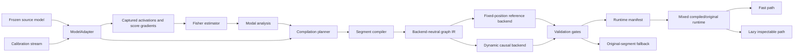

# Compiler architecture

## Status

This document describes the target architecture for turning the current
Fisher/modal experiments into a reusable compiler toolchain.

Two scopes are deliberately separate:

- **Current reference backend:** the checked two-layer toy transformer,
  fixed sequence length, exact activation Fisher analysis, position-indexed
  modal executors, algebraic fusion, and lazy instrumentation runtime.
- **Implemented compiler boundary:** model and activation adapters,
  heterogeneous layer specifications, variable-length calibration streams,
  adapter-owned segment execution, a strict model-level runtime manifest,
  canonical capability matching, and nonmutating mixed compiled/source
  dispatch.
- **Implemented dynamic-prefill scaffold:** length-independent Fisher
  projections, shared relative-position causal state, mixed-length boundary
  fitting, explicit compiled-site instrumentation metadata, and Fisher
  gradient collection through a mixed runtime.
- **Future production backend:** backend-neutral symbolic IR, efficient
  sliding-window kernels, cache-aware chunked prefill and decode, scalable
  Fisher estimators, and an external-model adapter.

The fixed backend remains the numerical regression oracle. Stages 1 and the
mixed-runtime core of stage 3 are implemented. Stage 4 now has an executable,
prefill-only trainable scaffold and adversarial sequence/runtime tests, but no
real transformer-layer dynamic artifact has passed end-to-end acceptance.
Compiler orchestration, the symbolic IR, efficient dynamic kernels, cache
ownership, and an external-model adapter remain targets.

## Goals

The compiler should make it possible to:

1. analyze a frozen decoder model without changing its weights;
2. capture named activations and score gradients through a model-specific
   adapter;
3. estimate activation-space Fisher modes with an estimator appropriate to
   the model width;
4. compile selected layer ranges into inspectable modal graph executors;
5. validate every replacement locally and end to end;
6. mix compiled and original segments in the same model;
7. run arbitrary supported sequence lengths in prefill and decode;
8. use a compact fast executor for ordinary inference while loading the
   inspectable graph only when instrumentation or interventions are requested;
9. retain the original segment as a safe fallback when a compiled segment
   fails a shape, capability, provenance, or quality gate.

The first objective is a clean experimental platform. Producing a universally
faster implementation for every transformer family is not an initial goal.

## Current reference pipeline

The implemented toy pipeline is:

```text
ToyTransformer and grouped dataset
              |
              v
activation and score-gradient capture
              |
              v
exact width-wise empirical Fisher matrices
              |
              v
Fisher eigendecomposition and interventions
              |
              v
fixed-position modal layer executor fitting
              |
              v
discarded-mode conditional completion
              |
              v
two-layer composition and validation
              |
              v
algebraic seven-tensor fusion
              |
              v
compact runtime with lazy logical instrumentation
```

This path proves that the analysis, replacement, composition, fusion, and lazy
instrumentation ideas can work together. It intentionally uses small exact
objects:

- model width is 32;
- sequence length is eight unpadded positions;
- two known transformer layers are compiled;
- Fisher matrices are full `32 x 32` matrices;
- position means and causal kernels contain the fixed sequence dimension;
- artifact schemas know the exact toy executor structure.

Those properties make the current backend an excellent oracle, but they are
not suitable contracts for variable-length or large-model execution.

## Target system



The major boundaries are the model adapter, analysis API, compiler IR,
lowering backends, artifact manifest, and runtime. Model-specific details
should stop at the adapter. Backend-specific tensor layouts should stop at the
lowering and runtime layers.

## Core contracts

The following sketches describe responsibilities, not final Python signatures.

### `ModelAdapter`

```python
class ModelAdapter(Protocol):
    def model_spec(self) -> ModelSpec: ...
    def layer_specs(self) -> Sequence[LayerSpec]: ...
    def activation_sites(self) -> Sequence[ActivationSite]: ...
    def fingerprint(self) -> SourceFingerprint: ...
    def execution_fingerprint(self) -> str: ...

    def embed(self, batch: ModelInputs) -> HiddenBatch: ...
    def run_segment(
        self,
        layer_range: LayerRange,
        hidden: HiddenBatch,
        context: SequenceContext,
        cache: CacheView | None,
        capture: CapturePlan | None = None,
    ) -> SegmentResult: ...
    def project_logits(self, hidden: HiddenBatch) -> Tensor: ...
```

The adapter:

- enumerates ordered layers and stable semantic activation sites;
- translates generic sequence and cache inputs into the source model's call
  convention;
- exposes segment boundaries without copying or mutating source weights;
- captures activations and, when supported, their score gradients;
- reports dtype, device, cache, backward, and intervention capabilities;
- fingerprints source configuration and weights for artifact provenance;
- fingerprints live non-tensor execution options, so changing values such as
  an attention scale cannot silently retain compiled authorization.

The adapter does not estimate Fisher matrices, choose mode counts, fit an
executor, or define runtime fallback policy.

`ToyTransformerAdapter` is the first implementation. It delegates capture and
intervention to the existing explicit trace, preserves activation aliasing,
normalizes sequence inputs, exposes ordered layer/segment metadata, and
installs replacements atomically. Fisher collection and modal Jacobian
extraction now exercise this adapter path.

### Model and layer descriptions

```python
@dataclass(frozen=True)
class ModelSpec:
    architecture: str
    layer_count: int
    hidden_size: int
    vocabulary_size: int
    max_context: int | None
    numeric_policy: NumericPolicy
    capabilities: CapabilitySet


@dataclass(frozen=True)
class LayerSpec:
    index: int
    hidden_size: int
    attention: AttentionSpec | None
    normalization: NormalizationSpec
    feed_forward: FeedForwardSpec
    activation_sites: tuple[ActivationSite, ...]
```

Layer descriptions must be per-layer rather than inferred once for the whole
stack. Large decoders may alternate attention policies, use different
positional rules by layer type, and have query/KV dimensions that cannot be
derived from hidden size alone.

Activation sites use semantic roles such as `block.input`,
`attention.output`, and `block.output`. Adapters map these roles to native
module paths. Compiler artifacts refer to semantic IDs plus the source
fingerprint instead of relying on Python class names.

### Sequence semantics

```python
@dataclass(frozen=True)
class SequenceContext:
    query_valid_mask: Tensor
    key_valid_mask: Tensor
    logical_positions: Tensor
    key_logical_positions: Tensor
    cache_positions: Tensor | None
    phase: Literal["prefill", "decode"]
    input_origin: SequenceInputOrigin
    cache_state: object | None = None
    adapter_payload: object | None = None
```

The core tensor axes are symbolic:

```text
B = batch
Q = query tokens processed by this invocation
K = visible cached and current key tokens
D = hidden width
```

A segment consumes and produces `[B, Q, D]`; it must not treat `Q` as the
model's maximum context.

`logical_positions` determine positional encoding and attention relationships.
`cache_write_slots` identify physical storage. They are separate because a
simple dense cache may use `slot == position`, while a sliding, ring, or paged
cache generally does not.

`MaskPolicy` is a semantic composition, for example:

```text
Causal
Causal AND SlidingWindow(1024)
Causal AND ValidTokens
Causal WITH BidirectionalSpans(image_spans)
```

The IR must not require a dense `[B, 1, Q, K]` mask. A backend may lower the
policy to an additive bias, boolean mask, sparse descriptor, or fused kernel.

### Cache semantics

```python
@dataclass(frozen=True)
class CacheSpec:
    layer_id: int
    policy: Literal["global", "sliding"]
    kv_heads: int
    head_dim: int
    capacity: int | None
    window_size: int | None
    dtype: DType
    device: DevicePlacement
    layout: str
```

The model runtime, not an individual compiled segment, owns cache lifetime.
Every original or compiled segment receives compatible per-layer cache views.
This allows:

- multi-token and chunked prefill;
- single-token decode;
- global append-only caches;
- bounded sliding caches;
- backend-specific dense, ring, or paged layouts;
- cache reordering or forking when a decoding strategy requires it;
- compiled and original segments to alternate without rebuilding state.

Prefill and decode equivalence is a validation property: processing a sequence
in one prefill, chunked prefills, or prefill plus token-by-token decode must
produce equivalent logits within the declared numeric tolerance.

### Numeric and placement policy

A single `dtype` field is insufficient. `NumericPolicy` records at least:

- parameter storage dtype and quantization format;
- activation compute dtype;
- normalization and reduction accumulation dtype;
- Fisher accumulation dtype;
- KV-cache dtype;
- output dtype;
- device/backend placement;
- tensor-layout or sharding constraints that affect compatibility.

Analysis and deployment capabilities are separate. A quantized inference
adapter may not provide usable autograd, so compilation may use a
full-precision analysis replica with the same source identity and deploy the
result against a quantized runtime only after an explicit compatibility gate.

## Analysis architecture

### Calibration input

Analysis consumes an iterable calibration stream, not one fixed in-memory
tensor. Each batch contains:

- tokens or input embeddings;
- `SequenceContext`;
- targets and a loss mask;
- stable example IDs for grouped splits and reproducibility;
- optional modality metadata.

Train, selection, and final evaluation data remain separated. No test data may
select an estimator, mode count, executor width, or validation threshold.

### Fisher estimators

```python
class FisherEstimator(Protocol):
    def update(self, activations: Tensor, score_gradients: Tensor, mask: Tensor): ...
    def finalize(self) -> FisherSummary: ...
```

Supported implementations should be capability-driven:

- `ExactFisher` for the toy reference;
- streaming covariance accumulation;
- randomized top-rank eigensolvers;
- blockwise or sketched approximations;
- distributed/sharded accumulation.

The estimator owns numerical accumulation and approximation error reporting.
The modal analysis consumes `FisherSummary`, not estimator-specific state.
This prevents the compiler from assuming a materialized `D x D` matrix at
large width.

## Compiler architecture

### Planning

`CompilationPlan` records:

- source model and adapter identity;
- requested layer segments;
- activation boundaries;
- Fisher estimator and retained-mode policy;
- executor backend and shape constraints;
- fit/selection data identities;
- validation thresholds;
- fallback policy.

Segments are independent compilation units. A plan may compile one layer,
several adjacent layers, or a prefix while retaining all other original
layers.

### Intermediate representation

The graph IR represents modal computation without a fixed runtime layout. It
needs:

- typed symbolic tensor axes;
- activation projection and reconstruction;
- causal or masked mixing;
- nonlinear transforms;
- discarded-mode completion;
- residual composition;
- named capture and intervention points;
- source-boundary and basis provenance;
- shape and backend capability guards.

Position-specific tables are legal in the current reference dialect, but are
marked with an exact-length guard. The dynamic dialect uses shared relative or
stateful causal operators whose parameters do not grow with a particular
sequence length.

### Lowering backends

#### Fixed-position reference backend — current

This backend retains the existing behavior:

- exact supported sequence length;
- position-conditioned means and normalization;
- independently parameterized position-coupled causal kernels;
- current modal completion and composition;
- monolithic and seven-tensor fusion;
- an opt-in packed causal-pair specialization derived from the authenticated
  seven-tensor runtime;
- lazy loading of the logical instrumentation graph.

It is the correctness oracle for refactoring. It should fail a shape guard
instead of silently accepting a different length.

The authenticated dense lazy runtime remains the default executor and the
instrumentation oracle. The packed specialization stores and evaluates only
the legal lower-triangular position pairs, but deliberately carries no
sidecar: capture and intervention requests must return to the dense lazy
runtime. It is currently a validation-gated, in-memory candidate rather than a
serialized runtime ABI. The generic PyTorch lowering wins narrowly at batch 1
on the recorded CPU and loses at larger batches because gather, temporary
pair-output, and indexed-reduction overhead exceed the saved multiplies. A
custom CPU or MLX/Metal kernel that schedules triangular blocks directly is
required before promotion to a default backend.

#### Packed triangular MLX/Metal kernel — next lowering

The packed reference establishes the storage layout and numerical oracle for a
custom kernel. The first Apple Silicon lowering should express the packed
executor with MLX array operations and compile the complete fast path with
`mx.compile`. If that graph still materializes gathered pair tensors and an
indexed reduction, the specialized path should use `mx.fast.metal_kernel`.

For a target position \(t\), its packed block row begins at \(t(t+1)/2\) and
contains only source positions \(0 \ldots t\). The Metal kernel should assign
threadgroups over batch, target-position, and output-feature tiles, then
accumulate those source blocks directly:

1. load the source activation tile and its packed coefficient tile;
2. accumulate in FP32 without materializing gathered position pairs;
3. add the target-position bias and fuse GELU before writing the next stage;
4. repeat for the bridge contraction, then apply the position-local decoder.

This schedule needs neither the reference implementation's pair-output tensor
nor `index_add`, so target rows have exclusive ownership and require no
atomics. At larger sequence lengths, the same idea becomes block-triangular:
use dense tiles below the causal diagonal and a masked diagonal tile so matrix
hardware remains well utilized.

The kernel should be constructed once and reused because MLX custom Metal
kernels are JIT compiled. Benchmarking must force lazy work with `mx.eval`,
separate cold compilation from steady-state execution, and retain the same
device-specific numerical and latency gates. Arithmetic reduction by itself
is insufficient.

#### Dynamic causal backend — prefill scaffold implemented

`VariableLengthCausalModalExecutor` now uses pooled Fisher projections and a
bank of exponentially decayed relative-position states. Its learned tensor
shapes are independent of sequence length. The current implementation:

- supports padding and ragged batches;
- accepts arbitrary logical position offsets;
- supports global and bounded sliding visibility;
- rejects negative or nonmonotonic valid positions;
- exposes trace/intervention points for modal input, causal state, hidden
  routing, modal output, and residual output;
- executes full prefill only, with no cache ownership or decode support.

For equal query/key positions and masks under global causality, execution uses
a Python recurrence with linear state size. Sliding windows or distinct
query/key positions/masks currently lower to dense `[B,Q,K,C]` decay weights,
so that path is quadratic and is not yet suitable for Gemma-scale contexts.
An efficient scan or ring/subtractive recurrence and a fused kernel remain
required.

A length-specialized fused kernel may sit beside the generic dynamic executor.
Runtime guards select it only when its constraints match.

### Validation gates

Compilation does not imply acceptance. Each segment must pass:

1. **Structural checks:** shapes, causality, mask policy, dtype, device,
   provenance, and immutability.
2. **Local equivalence:** original and compiled segment receive identical
   boundary activations and sequence context.
3. **End-to-end behavior:** accuracy, NLL, correct-token probability, output
   KL, and logit-margin drift.
4. **Progressive composition:** measure the model after each additional
   compiled segment so error accumulation is localized.
5. **Sequence checks:** trained and unseen lengths, padding patterns, position
   offsets, and local-window boundaries.
6. **Cache checks:** full prefill, chunked prefill, and decode equivalence.
7. **Instrumentation checks:** named captures and interventions agree with the
   logical executor; ordinary fast inference performs no sidecar load.
8. **Performance checks:** resident bytes, sidecar bytes, latency, and
   arithmetic counts are reported without replacing quality gates.

A failed segment remains original. Validation never authorizes fine-tuning
neighboring transformer layers.

## Artifact and runtime architecture

### Runtime manifest

A model-level manifest contains:

- format and compiler versions;
- source model, configuration, tokenizer, and weight fingerprints;
- adapter identity and semantic activation schema;
- segment ordering and original/compiled status;
- sequence and mask capabilities;
- numeric, device, layout, and cache policies;
- modal-basis and calibration provenance;
- fast tensor artifacts and inspectable sidecars;
- validation measurements and tolerances;
- fallback requirements.

Manifests are model-level, while tensor payloads and sidecars may remain
segment-level. This permits independent compilation and replacement.

### Mixed runtime

```text
embedding
    |
compiled segment 0
    |
original segment 1
    |
compiled segment 2
    |
original remainder
    |
output projection
```

The runtime dispatches each segment under the same `SequenceContext` and cache
owner. A compiled artifact whose guard does not match falls back to its
original segment when available.

`MixedSegmentDispatcher` implements this plan for prefill today. It resolves
all guarded paths before execution, never retries source fallback after a
compiled executor has begun, normalizes residual boundaries to a contiguous
ABI, and requires dtype/device preservation. Capability matching is
three-valued (`match`, `mismatch`, `unknown`); unknown manifest or backend facts
never authorize compiled execution. Instrumentation ownership comes from
adapter activation metadata and each binding's declared compiled sites, so a
multi-layer segment's backend-native taps are routed without name-prefix
guessing.

Strict mode carries the compiler-time adapter execution fingerprint in the
trusted runtime identity and executor binding. Each binding also carries
compiler-time fingerprints for its fast and inspectable executor objects.
The dispatcher measures the loaded objects independently, then re-fingerprints
source tensor state, live adapter execution options, and compiled executor
state at every compiled boundary. This closes both pre-binding drift and
mutations caused by earlier source work or interventions. The request's normalized
sequence tensors and metadata are snapshotted and checked after each segment,
so masks or positions cannot silently change beneath a preflight decision.
The capture/intervention plan is snapshotted as well, preventing an earlier
callback from expanding a later executor's authorized instrumentation surface.
Late integrity failures are fail-stop, never fallback/retry. The explicit
`trusted_immutable` mode skips repeated model/executor state hashing and is
safe only behind an authenticated loader that owns and freezes those objects;
sequence immutability remains enforced.

`InstrumentedModelBinding` attaches explicit `ActivationSite` metadata to the
mixed runner. `collect_instrumented_score_gradients` can then compute the same
activation-space Fisher samples for compiled modal taps without inferring
their axes or widths from strings.

The two execution modes remain:

- **Fast mode:** compact, pre-folded tensors for ordinary inference.
- **Inspectable mode:** provenance-checked logical modal graph loaded lazily
  for activation capture or interventions.

Lazy instrumentation is a representation switch. It is not a policy that
loads low-Fisher modes only when the model becomes uncertain.

## Gemma 3-class decoder requirements

Gemma 3 is a useful target because it exercises nearly every abstraction above
without requiring a mixture-of-experts runtime.

### Heterogeneous attention

Gemma 3 is decoder-only and uses grouped-query attention, QK normalization,
and pre/post RMSNorm. Its layer pattern repeats five local sliding-attention
layers followed by one global-attention layer, starting with a local layer.
The technical report describes a local span of 1024; Google's current
reference configuration uses 512 for the 1B variant and 1024 for larger
variants. Consequently:

- attention scope and window are per-layer configuration;
- query heads, KV heads, head dimension, and query scaling are independent
  fields;
- normalization and residual topology are adapter metadata;
- a compiler must not infer the whole stack from its first layer.

Sources:

- [Gemma 3 Technical Report](https://storage.googleapis.com/deepmind-media/gemma/Gemma3Report.pdf)
- [Official Gemma PyTorch configuration](https://github.com/google/gemma_pytorch/blob/main/gemma/config.py)
- [Official Gemma PyTorch model](https://github.com/google/gemma_pytorch/blob/main/gemma/model.py)

### Positions, masks, and long context

Gemma 3 uses separate RoPE policies for its attention types: a base wavelength
of 10,000 for local layers and 1,000,000 for global layers, with long-context
position scaling/interpolation. The original 1B model supports 32K tokens;
the larger original variants support 128K.

The sequence contract must therefore:

- carry logical positions explicitly;
- allow a layer to select its own positional policy;
- preserve arbitrary prefill offsets during decode;
- compose causal, local-window, padding, and modality mask rules;
- avoid dense maximum-context mask artifacts.

The official implementation explicitly selects local/global rotary tables,
passes local and global masks, and writes per-layer K/V caches at input
positions.

Sources:

- [Gemma 3 Technical Report](https://storage.googleapis.com/deepmind-media/gemma/Gemma3Report.pdf)
- [Google's Gemma 3 architecture explainer](https://developers.googleblog.com/en/gemma-explained-whats-new-in-gemma-3/)
- [Official Gemma PyTorch model](https://github.com/google/gemma_pytorch/blob/main/gemma/model.py)

### Cache behavior

The reference runtime maintains a K/V pair for every decoder layer, with KV
head count and head dimension taken from configuration. It uses multi-token
prefill and then one-position updates during decode.

For a scalable compiler:

- cache state is an explicit segment input/output;
- cache specs are heterogeneous by layer;
- local caches may be bounded or circular while global caches preserve the
  long context;
- physical cache layout is backend-specific;
- compiled and original layers must consume compatible logical state.

Google reports material CPU and GPU latency improvements from changing KV
cache layout, reinforcing that layout is a runtime capability rather than an
incidental tensor shape.

Sources:

- [Official Gemma PyTorch model](https://github.com/google/gemma_pytorch/blob/main/gemma/model.py)
- [Gemma 3 on mobile and web](https://developers.googleblog.com/en/gemma-3-on-mobile-and-web-with-google-ai-edge/)

### Numeric formats and devices

Google's reference configuration supports FP16, BF16, and FP32 storage, with
BF16 as the usual large-model default. The reference attention softmax and
RMSNorm use FP32 computation before casting back. The PyTorch implementation
also supports int8 weights, and Google publishes int4 quantization-aware
trained Gemma 3 variants.

The official runtimes target CPU, CUDA GPU, and PyTorch/XLA devices including
TPU; optimized Gemma deployments also target mobile CPU and GPU.

Implications:

- storage, compute, reduction, Fisher, and cache dtypes are distinct;
- quantization metadata and scales belong in the model/artifact contract;
- device and tensor layout are opaque capabilities, not CUDA booleans;
- validation tolerances are attached to a numeric policy;
- Fisher analysis may require a differentiable higher-precision replica even
  when deployment uses quantized weights.

Sources:

- [Official Gemma PyTorch repository](https://github.com/google/gemma_pytorch)
- [Official Gemma PyTorch configuration](https://github.com/google/gemma_pytorch/blob/main/gemma/config.py)
- [Gemma 3 QAT model release](https://developers.googleblog.com/en/gemma-3-quantized-aware-trained-state-of-the-art-ai-to-consumer-gpus/)

### Multimodal boundary

The 1B Gemma 3 model is text-only. The original 4B, 12B, and 27B models add a
SigLIP vision encoder and projector. Images enter the language decoder as 256
projected soft-token vectors, and image-token regions use bidirectional
attention while generated text remains autoregressive.

The initial compiler should not absorb the vision encoder. Its decoder input
boundary should nevertheless support:

- token IDs or precomputed input embeddings;
- modality spans and embedding provenance;
- mask policies with bidirectional image spans inside an otherwise causal
  sequence.

This makes Gemma 3 1B the clean first integration target. The same decoder
adapter can later accept projected image tokens for a larger variant without
redesigning sequence semantics.

Sources:

- [Gemma 3 Technical Report](https://storage.googleapis.com/deepmind-media/gemma/Gemma3Report.pdf)
- [Google's Gemma 3 architecture explainer](https://developers.googleblog.com/en/gemma-explained-whats-new-in-gemma-3/)

## Staged migration

Each stage keeps the previous stage executable and must pass its validation
suite before broadening scope.

### Stage 0: lock the reference — complete

- Preserve current toy artifacts, reports, numerical gates, and lazy runtime.
- Treat the current fixed-length behavior as a compatibility fixture.
- Record exact source and artifact schema versions.

### Stage 1: introduce contracts around existing behavior — core implemented

- Add immutable layer, activation-site, and sequence descriptions.
- Implement `ToyTransformerAdapter` by delegation.
- Route one existing analysis run through the adapter.
- Require zero numerical change and no rewrite of legacy artifacts.
- Remaining: make numeric policy and capability metadata explicit rather than
  inferring them from adapter methods and tensor state.

### Stage 2: add compiler orchestration

- Introduce `FisherEstimator`, `CompilationPlan`, `CompiledSegment`, and
  validation-result interfaces.
- Provide one orchestration API and CLI over the existing experiment stages.
- Continue lowering exclusively to the fixed-position reference backend.

### Stage 3: generalize depth and manifests — runtime core implemented

- Replace the special two-layer runtime schema with an ordered N-segment
  manifest. This schema and a nonmutating wrapper for the checked runtime are
  implemented.
- Support mixed original and compiled segments. The prefill dispatcher,
  guarded fallback, full source runtime, and multi-layer compiled-site routing
  are implemented.
- Remaining: compile several toy depths and seeds without per-checkpoint code
  changes.
- Remaining: validate every progressive compiled prefix.

### Stage 4: implement the dynamic sequence backend — partial

- Implemented: shared relative/stateful causal parameters independent of
  sequence length.
- Implemented: padding, sparse-mask, offset, position-gap, distinct query/key,
  causality, and local-window-boundary tests.
- Implemented: detached source-boundary batch contracts, valid-position
  weighted fitting, best-selection checkpoint restoration, and per-length
  reports.
- Remaining: symbolic backend-neutral `B/Q/K` IR and lowering.
- Remaining: collect real toy-transformer boundary pairs, select without test
  leakage, serialize provenance, and pass local plus end-to-end held-out-length
  gates.
- Remaining: replace the quadratic sliding/distinct-position path and Python
  recurrence with scalable kernels.

### Stage 5: add cache-aware prefill and decode

- Make cache state and physical placement explicit.
- Validate full prefill, chunked prefill, and token decode equivalence.
- Support both global and bounded sliding cache policies.
- Exercise mixed compiled/original execution with one cache owner.

### Stage 6: scale Fisher analysis

- Add streaming randomized and block/sketch estimators.
- Report approximation residuals and modal stability against exact Fisher on
  small models.
- Stream calibration data and support sharded accumulation.

### Stage 7: attach an external text decoder

- Implement a Gemma-compatible adapter against a small or reduced checkpoint.
- Then target Gemma 3 1B text-only.
- Compile isolated segments first, leaving the remainder original.
- Expand depth only after local, end-to-end, sequence, and cache gates pass.

### Stage 8: add the multimodal decoder boundary

- Accept projected image embeddings and modality spans.
- Validate bidirectional image-region masks plus causal text generation.
- Keep vision encoding as a separate adapter/component until decoder
  compilation is stable.

## Definition of a successful generalization

The architecture has moved beyond the toy experiment when:

- a new compatible decoder requires an adapter, not edits to Fisher,
  compilation, or runtime core;
- a new sequence length requires data and validation, not new parameter
  shapes in the generic backend;
- an arbitrary layer segment can compile, fail, or fall back independently;
- prefill and decode share explicit cache semantics;
- ordinary inference loads no instrumentation sidecars;
- source transformer weights remain unchanged;
- every artifact states exactly which model, layer boundaries, shapes,
  numeric policy, and validation evidence authorize its use.
